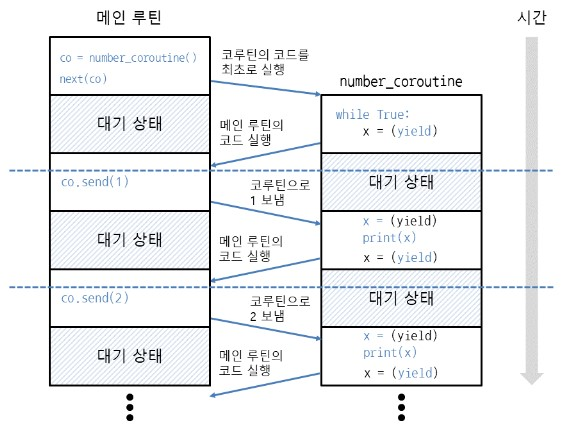
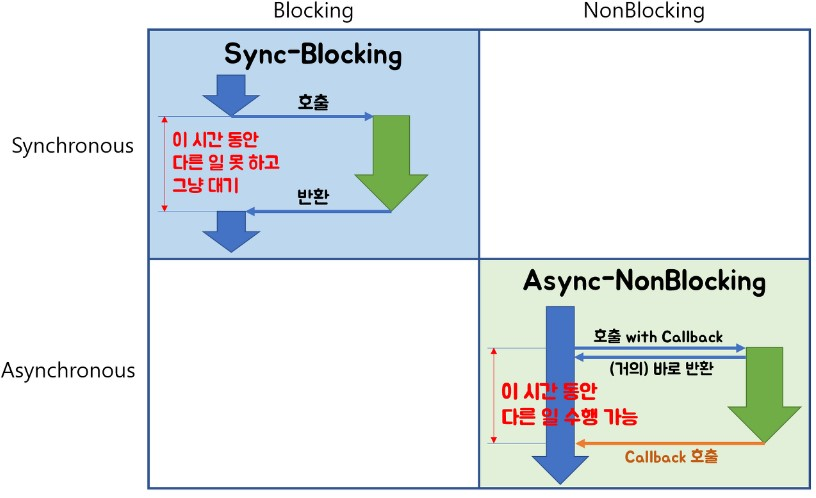
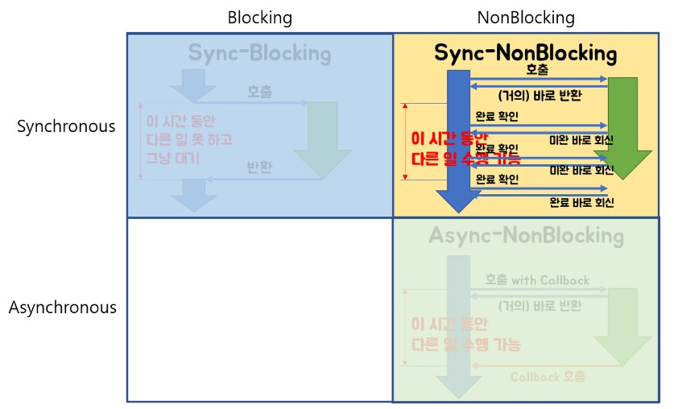
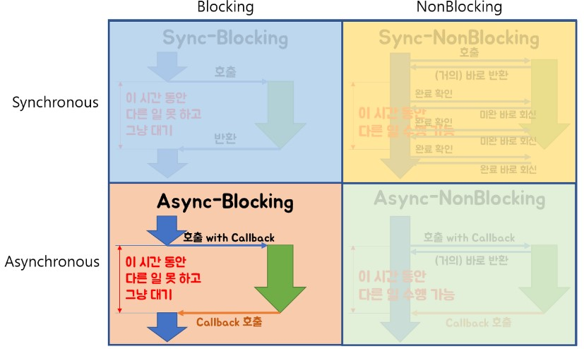

## Table of Contents

- [클래스(class), 객체(object), 인스턴스(instance), 어트리뷰트(attribute) 용어 설명](#1)
- [`__str__`과 `__repr__` 의 차이점](#2)
- [`__dict__` 와 `dir()` 의 차이점](#3)
- [`__doc__`](#4)
- [클래스 변수와 인스턴스 변수](#5)
- [`__init__`과 `__del__`](#6)
- [@classmethod 와 @staticmethod](#7)
- [다양한 special method (= magic method)](#8)
- [namedtuple](#9)
- [이터레이터(Iterator)와 제너레이터(Generator)](#10)
- [위치 인자와 키워드 인자의 패킹(packing)과 언패킹(unpacking)](#11)
- [filter, map](#12)
- [reduce, partial](#13)
- [global, local, nonlocal](#14)
- [클로저(closure)](#15)
- [데코레이터(Decorator)](#16)
- [코루틴(Coroutine)](#17)
- [GIL(Global Interpreter Lock)](#18)
- [multi threading / multi processing](#19)
- [CPU Bound vs I/O Bound (Multiprocessing vs Threading vs AsyncIO) (cf. Concurrency(동시성) vs Parallelism(병렬성) // Blocking IO vs Non-Blocking IO // Sync vs ASync)](#20)
- [hasattr / getattr / setattr](#21)
- [시간 표현 방법(time, datetime, pytz)](#22)
---

## #1

### 클래스(class), 객체(object), 인스턴스(instance), 어트리뷰트(attribute) 용어 설명

- 클래스(Class)와 객체(Object)
    - 클래스와 객체는 붕어빵틀과 붕어빵의 관계
    - 붕어빵틀이 주어지면 그 안에 팥, 고구마, 슈크림, 김치, 초코 붕어빵등 형태에 맞는 붕어빵을 계속 찍어냄

- 객체(Object)와 인스턴스(instance)
    - 인스턴스는 객체를 실체화 시킨것
    - 붕어빵 재료들을 설정하고 그거를 이제 실제로 만들어내면 인스턴스가 됨(실제로 만들기 전 값을 세팅해놓은것이 객체)
    - 차를 통한 이해 : 클래스(그랜저 설계도), 객체(어떤 옵션을 추가한 실제 그랜저), 인스턴스(실제 그랜저 중 단 하나,(고유한 id))
    - 같다고 봐도 무방함

- 어트리뷰트(attribute)
    - 클래스 내부에 포함되어 있는 함수(메서드)나 변수 등을 의미

#### References
- https://www.codeit.kr/community/threads/8735?utm_source=google_paid&utm_medium=pmax&utm_campaign=da_purchase&utm_content=general&gclid=CjwKCAiA76-dBhByEiwAA0_s9aeUx4hqCpREAjeBDEwVDKOo0uFK0rQQJHO0-wNg_C5J2xK5zWV3vhoCMDcQAvD_BwE

---

## #2

### `__str__`과 `__repr__` 의 차이점

- `__str__` 는 사용자 레벨에서 디버깅, `__repr__` 은 엔지니어 레벨에서 디버깅
- print(인스턴스명)시 우선순위 
    - 1순위 : `__str__` , 2순위 : `__repr__`
    - print(repr(인스턴스명)) 하면 `__str__`이 존재하더라도 `__repr__` 출력
- 코드
    ```python
    class Student():
        def __init__(self, name, details):
            self._name = name
            self._details = details

        def __str__(self):
            return 'str : {} - {}'.format(self._name, self._details)

        def __repr__(self):
            return 'repr : {} - {}'.format(self._name, self._details)
        

    student1 = Student('철수', {'school':'inha','grade':1,'number':'010-1111-1111'})
    print(student1)
    print(repr(student1))
    '''
    str : 철수 - {'school': 'inha', 'grade': 1, 'number': '010-1111-1111'}
    repr : 철수 - {'school': 'inha', 'grade': 1, 'number': '010-1111-1111'}
    '''

    ```
- 인스턴스 한개만을 print할때만 `__str__`이 최우선순위, 자료구조형태에 들어갔을경우는 `__repr__` 형태로 출력
    ```python
    class Student():
        def __init__(self, name, details):
            self._name = name
            self._details = details

        def __str__(self):
            return 'str : {} - {}'.format(self._name, self._details)

        def __repr__(self):
            return 'repr : {} - {}'.format(self._name, self._details)
        
    student_list = []

    student1 = Student('철수', {'school':'inha','grade':1,'number':'010-1111-1111'})
    student2 = Student('짱구', {'school':'inha','grade':2,'number':'010-2222-2222'})
    student3 = Student('훈이', {'school':'inha','grade':1,'number':'010-3333-3333'})

    student_list.append(student1)
    student_list.append(student2)
    student_list.append(student3)

    print(student_list)

    for x in student_list:
        print(x)
    
    '''
    [repr : 철수 - {'school': 'inha', 'grade': 1, 'number': '010-1111-1111'}, repr : 짱구 - {'school': 'inha', 'grade': 2, 'number': '010-2222-2222'}, repr : 훈이 - {'school': 'inha', 'grade': 1, 'number': '010-3333-3333'}]
    str : 철수 - {'school': 'inha', 'grade': 1, 'number': '010-1111-1111'}
    str : 짱구 - {'school': 'inha', 'grade': 2, 'number': '010-2222-2222'}
    str : 훈이 - {'school': 'inha', 'grade': 1, 'number': '010-3333-3333'}
    '''
    ```

#### References
- https://wikidocs.net/134994
- [우리를 위한 프로그래밍 : 파이썬 중급](https://www.inflearn.com/course/%ED%94%84%EB%A1%9C%EA%B7%B8%EB%9E%98%EB%B0%8D-%ED%8C%8C%EC%9D%B4%EC%8D%AC-%EC%A4%91%EA%B8%89-%EC%9D%B8%ED%94%84%EB%9F%B0-%EC%98%A4%EB%A6%AC%EC%A7%80%EB%84%90)

---

## #3

### `__dict__` 와 `dir()` 의 차이점

- `인스턴스.__dict__`
    - 인스턴스 안에 들어있는 속 정보까지 모두 파악 가능(단, 클래스 변수는 출력되지 않음)
        ```python
        class Student():
            student_count = 0
            
            def __init__(self, name, details):
                self._name = name
                self._details = details
                Student.student_count+=1

            def __str__(self):
                return 'str : {} - {}'.format(self._name, self._details)

            def __repr__(self):
                return 'repr : {} - {}'.format(self._name, self._details)
            
            def __del__(self):
                Student.student_count-=1

        student1 = Student('철수', {'school':'inha','grade':1,'number':'010-1111-1111'})
        student2 = Student('짱구', {'school':'inha','grade':2,'number':'010-2222-2222'})

        print(student1.__dict__)
        '''
        {'_name': '철수', '_details': {'school': 'inha', 'grade': 1, 'number': '010-1111-1111'}}
        '''
        ```
- `dir(인스턴스)`
    - 클래스 안에서 사용되고 있는 메서드 이름이랑 변수명 모두 출력(클래스 변수명까지 출력됨)
    - 단, 안에 들어 있는 내용까지는 모름
    - 코드
        ```python
        class Student():
            student_count = 0
            
            def __init__(self, name, details):
                self._name = name
                self._details = details
                Student.student_count+=1

            def __str__(self):
                return 'str : {} - {}'.format(self._name, self._details)

            def __repr__(self):
                return 'repr : {} - {}'.format(self._name, self._details)
            
            def __del__(self):
                Student.student_count-=1

        student1 = Student('철수', {'school':'inha','grade':1,'number':'010-1111-1111'})
        student2 = Student('짱구', {'school':'inha','grade':2,'number':'010-2222-2222'})

        print(dir(student1))
        '''
        ['__class__', '__del__', '__delattr__', '__dict__', '__dir__', '__doc__', '__eq__', '__format__', '__ge__', '__getattribute__', '__gt__', '__hash__', '__init__', '__init_subclass__', '__le__', '__lt__', '__module__', '__ne__', '__new__', '__reduce__', '__reduce_ex__', '__repr__', '__setattr__', '__sizeof__', '__str__', '__subclasshook__', '__weakref__', '_details', '_name', 'student_count']
        '''
        ```

#### References
- [우리를 위한 프로그래밍 : 파이썬 중급](https://www.inflearn.com/course/%ED%94%84%EB%A1%9C%EA%B7%B8%EB%9E%98%EB%B0%8D-%ED%8C%8C%EC%9D%B4%EC%8D%AC-%EC%A4%91%EA%B8%89-%EC%9D%B8%ED%94%84%EB%9F%B0-%EC%98%A4%EB%A6%AC%EC%A7%80%EB%84%90)


---

## #4 

### `__doc__` 

- 함수나 클래스를 작성할때는 항상 doc 달아주기
- """ 사이에 내용 작성
    - 간단한 설명 + params 설명 + return 설명
    - `.__doc__`을 통해 함수나 클래스에 대핸 설명 참조가능
        ```python
        def get_news(keywords, client_id, client_secret):
            """
            네이버 검색 뉴스 API 사용해 특정 키워드들의 뉴스 검색
            :params list keywords: 키워드 리스트
            :params str client_id: 인증정보
            :params str client_secret: 인증정보
            :return news_items : API 검색 결과 중 뉴스 item들
            :rtype list
            """
        print(get_news.__doc__)
        '''
        네이버 검색 뉴스 API 사용해 특정 키워드들의 뉴스 검색
        :params list keywords: 키워드 리스트
        :params str client_id: 인증정보
        :params str client_secret: 인증정보
        :return news_items : API 검색 결과 중 뉴스 item들
        :rtype list
        '''
        ```

---

## #5

### 클래스 변수와 인스턴스 변수

- 클래스 변수는 모든 인스턴스가 공유함
    - 클래스 변수는 생성자 위에 작성
- 인스턴스 변수는 자신만의 것
- 아래 코드 처럼 학생 클래스에서 인스턴스가 생성되거나 사라질때마다 기록할수 있는 값이나 모든 인스턴스가 동일하게 사용하는 값들을 보통 클래스 변수로 사용
- 코드
    ```python
    class Student():
        student_count = 0
        
        def __init__(self, name, details):
            self._name = name
            self._details = details
            Student.student_count+=1

        def __str__(self):
            return 'str : {} - {}'.format(self._name, self._details)

        def __repr__(self):
            return 'repr : {} - {}'.format(self._name, self._details)
        
        def __del__(self):
            Student.student_count-=1

    student1 = Student('철수', {'school':'inha','grade':1,'number':'010-1111-1111'})
    student2 = Student('짱구', {'school':'inha','grade':2,'number':'010-2222-2222'})

    print(student1.student_count)
    print(student2.student_count)
    print(Student.student_count)
    '''
    2
    2
    2
    '''
    ```
    (인스턴스.클래스변수, 클래스.클래스변수 둘다 동일하게 나옴)

#### References
- [우리를 위한 프로그래밍 : 파이썬 중급](https://www.inflearn.com/course/%ED%94%84%EB%A1%9C%EA%B7%B8%EB%9E%98%EB%B0%8D-%ED%8C%8C%EC%9D%B4%EC%8D%AC-%EC%A4%91%EA%B8%89-%EC%9D%B8%ED%94%84%EB%9F%B0-%EC%98%A4%EB%A6%AC%EC%A7%80%EB%84%90)

---

## #6

### `__init__`과 `__del__`

- `__init__` 은 클래스를 통해 인스턴스가 생성될때마다 실행되는 메서드
    - `__init__` 에 있는 입력 인자를 인스턴스 생성시에 집어넣어줘야함
- `__del__` 은 `del 인스턴스명` 을 통해 인스턴스가 삭제될때마다 실행되는 메서드
- 코드
    ```python
    class Student():
        student_count = 0
        
        def __init__(self, name, details):
            self._name = name
            self._details = details
            Student.student_count+=1

        def __str__(self):
            return 'str : {} - {}'.format(self._name, self._details)

        def __repr__(self):
            return 'repr : {} - {}'.format(self._name, self._details)
        
        def __del__(self):
            Student.student_count-=1

    student1 = Student('철수', {'school':'inha','grade':1,'number':'010-1111-1111'})
    student2 = Student('짱구', {'school':'inha','grade':2,'number':'010-2222-2222'})

    print(Student.student_count)
    del student1
    print(Student.student_count)
    '''
    2
    1
    '''
    ```

---

## #7

### @classmethod 와 @staticmethod

- 일반적으로 클래스 내부에서 변수명에 접근할때는 클래스 메서드 또는 인스턴스 메서드를 사용하여 접근
    - 클래스 변수에 접근할때는 클래스 메서드 사용(클래스 메서드 위에 @classmehtod 데코레이터 사용)
    - 인스턴스 변수에 접근할때는 인스턴스 메서드 사용(아무런 표시 없음)
- @classmethod
    - self대신 cls로 작성
    - 코드
        ```python
        class Student():
            student_count = 0
            tuition = 1000000
            
            def __init__(self, name, details):
                self._name = name
                self._details = details
                Student.student_count+=1

            def __str__(self):
                return 'str : {} - {}'.format(self._name, self._details)

            def __repr__(self):
                return 'repr : {} - {}'.format(self._name, self._details)
            
            def __del__(self):
                Student.student_count-=1
            
            @classmethod
            def change_tuition(cls,price):
                cls.tuition = price

        student1 = Student('철수', {'school':'inha','grade':1,'number':'010-1111-1111'})
        student2 = Student('짱구', {'school':'inha','grade':2,'number':'010-2222-2222'})

        print(Student.tuition)
        Student.change_tuition(2000000)
        print(Student.tuition)
        '''
        1000000
        2000000
        '''

        ```
- @staticmethod
    - 클래스 메서드 인스턴스 메서드 둘다 아닌 일반적인 함수 이지만 클래스안에 존재할경우 @staticmethod 표시 (클래스와 관련이 있기 때문에 일반적인 함수이지만 클래스 안에 작성)
    - @classmethod 와 상당히 유사하지만 상속 부분에서 명백한 차이 존재
        - 상속을 받을 경우 classmethod에서 작성되었던 cls 부분이 상속받은 클래스 명을 의미함. 즉, 상속을 받았을때 상속 받은 대상에 따라 변화무쌍한 값을 얻고 싶다면 @classmethod를 사용하고 상속을 받든 말든 고정된 값을 가지고 싶다면 @staticmethod를 사용해서 cls 대신 그때 클래스 명을 직접 작성
        - 코드
            ```python
            class Language:
                default_language = "English"

                def __init__(self):
                    self.show = '나의 언어는' +' '+ self.default_language

                @classmethod
                def class_my_language(cls):
                    return cls()

                @staticmethod
                def static_my_language():
                    return Language()

                def print_language(self):
                    print(self.show)


            class KoreanLanguage(Language):
                default_language = "한국어"
                
            a = KoreanLanguage.static_my_language()
            b = KoreanLanguage.class_my_language()
            a.print_language()
            b.print_language()
            '''
            >>
            나의 언어는 English
            나의 언어는 한국어
            '''
            ```

#### References
- https://wikidocs.net/16074
- [우리를 위한 프로그래밍 : 파이썬 중급](https://www.inflearn.com/course/%ED%94%84%EB%A1%9C%EA%B7%B8%EB%9E%98%EB%B0%8D-%ED%8C%8C%EC%9D%B4%EC%8D%AC-%EC%A4%91%EA%B8%89-%EC%9D%B8%ED%94%84%EB%9F%B0-%EC%98%A4%EB%A6%AC%EC%A7%80%EB%84%90)

---

## #8

### 다양한 special method (= magic method)

- `__(메서드 이름)__` 이런 형태를 special method라고 함
- 파이썬이 내부적으로 구현된(빌트인) 메서드를 구현함
- 인스턴스끼리 연산을 하기 위해서는 직접 변수명을 언급하고 따로 함수를 만들어야하는 번거로움 존재.
    - special method를 이용한다면 인스턴스끼리 내가 정의한 방식때로 연산이 가능해짐
- 코드
    ```python
    class Vector(object):
        def __init__(self, *args):
            '''Create a vector, example : v = Vector(5,10)'''
            if len(args) == 0:
                self._x, self._y = 0, 0
            else:
                self._x, self._y = args

        def __repr__(self):
            '''Returns the vector infomations'''
            return 'Vector(%r, %r)' % (self._x, self._y)

        def __add__(self, other):
            '''Returns the vector addition of self and other'''
            return Vector(self._x + other._x, self._y + other._y)
        
        def __mul__(self, y):
            return Vector(self._x * y, self._y * y)

        def __bool__(self):
            return bool(max(self._x, self._y))


    # Vector 인스턴스 생성
    v1 = Vector(5,7)
    v2 = Vector(23, 35)
    v3 = Vector()

    # 매직메소드 미사용 (매번 연산할때마다 번거로움)
    print('매직메소드 미사용 : ', Vector(v1._x + v2._x, v1._y + v2._y)) 


    # 매직메소드 출력
    print(Vector.__init__.__doc__)
    print(Vector.__repr__.__doc__)
    print(Vector.__add__.__doc__)
    print(v1, v2, v3)
    print(v1 + v2)
    print(v1 * 3)
    print(v2 * 10)
    print(bool(v1), bool(v2))
    print(bool(v3))
    '''
    매직메소드 미사용 :  Vector(28, 42)
    Create a vector, example : v = Vector(5,10)
    Returns the vector infomations
    Returns the vector addition of self and other
    Vector(5, 7) Vector(23, 35) Vector(0, 0)
    Vector(28, 42)
    Vector(15, 21)
    Vector(230, 350)
    True True
    False
    '''
    ```

- 다양한 예시
    ```python
    __lt__(self, other) # self<other
    __le__(self, other) # self<=other
    __eq__(self, other) # self==other
    __ne__(self, other) # self!=other
    __gt__(self, other) # self>other
    __ge__(self, other) # self>=other
    __add__(self, other) # self+other
    __sub__(self, other) # self-other
    __mul__(self, other) # self*other
    __matmul__(self, other) # self@other
    __truediv__(self, other) # self/other
    __floordiv__(self, other) # self//other
    __mod__(self, other) # self%other
    __divmod__(self, other) # divmod(self,other)
    __pow__(self, other)# self**other
    __lshift__(self, other) # self<<other
    __rshift__(self, other) # self>>other
    __and__(self, other) # self&other
    __xor__(self, other) # self^other
    __or__(self, other) # self|other
    ```

####
- https://docs.python.org/3/reference/datamodel.html
- https://zzsza.github.io/development/2020/07/05/python-magic-method/
- [우리를 위한 프로그래밍 : 파이썬 중급](https://www.inflearn.com/course/%ED%94%84%EB%A1%9C%EA%B7%B8%EB%9E%98%EB%B0%8D-%ED%8C%8C%EC%9D%B4%EC%8D%AC-%EC%A4%91%EA%B8%89-%EC%9D%B8%ED%94%84%EB%9F%B0-%EC%98%A4%EB%A6%AC%EC%A7%80%EB%84%90)

---

## #9

### namedtuple

- tuple을 딕셔너리처럼 키를 지정해서 사용가능
- 다양한 선언 방법이 존재
- 코드
    ```python
    # 네임드 튜플 사용
    from collections import namedtuple

    # 네임드 튜플 선언 방법
    Point1 = namedtuple('Point', ['x', 'y'])
    Point2 = namedtuple('Point', 'x, y')
    Point3 = namedtuple('Point', 'x y')
    Point4 = namedtuple('Point', 'x y x class', rename=True) # Default=False 변수명이 같은 경우 rename=True로 지정하게되면 오류없이 변수이름이 수정됨


    # 출력
    print(Point1, Point2, Point3, Point4)

    # Dict to Unpacking
    temp_dict = {'x': 75, 'y': 55}
    temp = [52, 38]

    p1 = Point1(x=10, y=35)
    p2 = Point2(20, 40)
    p3 = Point3(45, y=20)
    p4 = Point4(10, 20, 30, 40)
    p5 = Point3(**temp_dict)
    p6 = Point3(*temp)

    print(p1, p2, p3, p4, p5, p6)

    '''
    <class '__main__.Point'> <class '__main__.Point'> <class '__main__.Point'> <class '__main__.Point'>
    Point(x=10, y=35) Point(x=20, y=40) Point(x=45, y=20) Point(x=10, y=20, _2=30, _3=40) Point(x=75, y=55) Point(x=52, y=38)
    '''
    ```

####
- [우리를 위한 프로그래밍 : 파이썬 중급](https://www.inflearn.com/course/%ED%94%84%EB%A1%9C%EA%B7%B8%EB%9E%98%EB%B0%8D-%ED%8C%8C%EC%9D%B4%EC%8D%AC-%EC%A4%91%EA%B8%89-%EC%9D%B8%ED%94%84%EB%9F%B0-%EC%98%A4%EB%A6%AC%EC%A7%80%EB%84%90)

---

## #10

### 이터레이터(Iterator)와 제너레이터(Generator)
- 이터레이터(Iterator)
    - Iterator란 값을 차례대로 꺼낼 수 있는 객체
    - iterator는 iterable한 객체를 내장함수 또는 iterable객체의 메소드를 통해 생성 가능
        - 파이썬 내장함수 iter()를 사용해 iterator 객체 생성 가능
            ```python
            a = [1,2,3]
            print(type(a))
            a_iter = iter(a)
            print(type(a_iter))
            '''
            <class 'list'>
            <class 'list_iterator'>
            '''
            ```
        - iterable 객체는 매직메서드 (`__iter__`)메서드를 가지고 있음. 이 메서드로 Iterator 만들기
            ```python
            a = [1,2,3]
            print(dir(a))
            print(hasattr(a, '__iter__'))

            a_iter = a.__iter__()
            print(type(a_iter))

            print(next(a_iter))
            print(next(a_iter))
            print(next(a_iter))
            print(next(a_iter))
            '''
            1
            2
            3
            StopIteration
            '''
            ``` 
- 제너레이터(Generator)
    - generator란 iterator 를 생성해주는 함수, 함수안에 yield 키워드 사용
    - 무한한 순서가 있는 객체를 모델링 가능
    - yield 예시
        ```python
        def test_generator():
            print('yield 1 전')
            yield 1
            print('yield 1과 2사이')
            yield 2
            print('yield 2와 3사이')
            yield 3
            print('yield 3 후')

        g = test_generator()
        next(g)
        next(g)
        next(g)
        next(g)
        '''
        yield 1 전
        yield 1과 2사이
        yield 2와 3사이
        yield 3 후

        StopIteration 발생
        '''

        ```
        (다음 4번째 next(g)를 실행할때 다음 yield가 있는지 코드를 더 내려갔는데('yield 3 후' 까지 출력) yield가 더이상 없고 함수가 끝났으므로 오류발생)
    - 무한한 순서 있는 객체 예시
        ```python
        def infinite_generator():
            count = 0
            while True:
                count+=1
                yield print(count)

        g = infinite_generator()
        next(g)
        next(g)
        next(g)
        next(g)
        next(g)
        next(g)
        next(g)
        '''
        1
        2
        3
        4
        5
        6
        7
        '''
        ```
    - iterable한 객체를 yield할 때는 yield from iterable객체 사용
        ```python
        def three_generator():
            a = [1, 2, 3]
            yield from a

        gen = three_generator()
        print(next(gen))
        print(next(gen))
        print(list(gen))
        print(next(gen))
        '''
        1
        2
        [3]

        StopIteration 발생
        '''
        ```
        (list로 묶어서 한번에 나오면 모든 yield가 다 나오게됨. 따라서 list로 모두 꺼낸후 next를 실행하게 되면 오류발생)
    - 리스트 컴프리헨션 방식을 ( )로 묶어주면 generator가 됨
        ```python
        a = (i for i in [10,20,30] if i>=20)
        print(a)
        print(next(a))
        print(next(a))
        print(next(a))
        '''
        <generator object <genexpr> at 0x0000017E62DA0350>
        20
        30

        StopIteration 발생
        '''
        ```
    - 클래스를 생성하고 `__iter__` 메서드를 작성하여 제너레이터 생성하기
        ```python
        class WordSplitGenerator:
            def __init__(self, text):
                self._text = text.split(' ')
            
            def __iter__(self):
                # print('Called __iter__')
                for word in self._text:
                    yield word # 제네레이터
                return
            
            def __repr__(self):
                return f'WordSplit({self._text})'


        wg = WordSplitGenerator('Do today what you could do tomorrow')
        # 여기서 바로 next(wg) 하면 오류 발생

        wt = iter(wg) # iter(객체)를 해주게 되면 generator가 됨

        print(wg)
        print(wt)
        print(next(wt))
        print(next(wt))
        print(next(wt))
        print(next(wt))
        print(next(wt))
        print(next(wt))
        print(next(wt))
        '''
        WordSplit(['Do', 'today', 'what', 'you', 'could', 'do', 'tomorrow'])
        <generator object WordSplitGenerator.__iter__ at 0x0000010CB4060350>    
        Do
        today
        what
        you
        could
        do
        tomorrow
        '''
        ```
    - 참고 : generator를 생성안하고 `__next__` 메서드를 이용하여 바로 next 적용할수 있게 만들기 (위의 방법이 확실한 제너레이터 생성 방법, 이건 단지 참고용으로 작성)
        ```python
        class WordSplitIter:
            def __init__(self, text):
                self._idx = 0
                self._text = text.split(' ')
            
            def __next__(self):
                # print('Called __next__')
                try:
                    word = self._text[self._idx]
                except IndexError:
                    raise StopIteration('Stopped Iteration.')
                self._idx += 1
                return word

            def __repr__(self):
                return f'WordSplit({self._text})'


        wi = WordSplitIter('Do today what you could do tomorrow')

        print(wi)
        print(next(wi))
        print(next(wi))
        print(next(wi))
        print(next(wi))
        print(next(wi))
        print(next(wi))
        print(next(wi))       
        '''
        WordSplit(['Do', 'today', 'what', 'you', 'could', 'do', 'tomorrow'])
        Do
        today
        what
        you
        could
        do
        tomorrow
        ''' 
        ```
        
#### References
- https://wikidocs.net/16068
- https://wikidocs.net/16069
- [우리를 위한 프로그래밍 : 파이썬 중급](https://www.inflearn.com/course/%ED%94%84%EB%A1%9C%EA%B7%B8%EB%9E%98%EB%B0%8D-%ED%8C%8C%EC%9D%B4%EC%8D%AC-%EC%A4%91%EA%B8%89-%EC%9D%B8%ED%94%84%EB%9F%B0-%EC%98%A4%EB%A6%AC%EC%A7%80%EB%84%90)
---

## #11

### 위치 인자와 키워드 인자의 패킹(packing)과 언패킹(unpacking)
- 간단한 예시
    ```python
    a_list = [1,2,3,4,5]

    a, *b, c = a_list
    print(a,*b,c)
    print(a,b,c)
    '''
    1 2 3 4 5
    1 [2, 3, 4] 5
    '''
    ```
    - b변수 앞에 *를 붙여주게 되면 b가 리스트로 인식됨.)
        - (참고 : **를 두개 붙여주면 딕셔너리로 인식됨, 이 때는 키값이 필요)
    - 2,3,4 원소를 b로 packing된것)
    - 리스트 b 앞에 *를 붙여서 줄력하게 되면 리스트 b가 unpacking되어서 출력됨)    
- packing은 인자로 받은 여러개의 값을 하나의 객체로 합쳐서 받을 수 있도록 함
    - 함수에서 여러값을 길이 제한없이 받고 싶을 경우 사용
    - 위치 인자 패킹 (* 사용)
        ```python
        def sum_all(*numbers):
            result = 0
            for number in numbers:
                result += number
            return result

        print(sum_all(1, 2, 3)) # 6
        print(sum_all(1, 2, 3, 4, 5, 6)) # 21
        '''
        6
        21
        '''
        ```
        (숫자를 나열해서 전달하게 되면 numbers라는 list로 묶여서 함수안에서 실행됨)    
    - 키워드 인자 패킹 (** 사용)
        ```python
        def print_family_name(father, mother, **sibling):
            print("아버지 :", father)
            print("어머니 :", mother)
            if sibling:
                print("호적 메이트..")
                for title, name in sibling.items():
                    print('{} : {}'.format(title, name))

        print_family_name("홍길동", '심사임당', 누나='김태희', 여동생='윤아')
        '''
        아버지 : 홍길동
        어머니 : 심사임당
        호적 메이트..
        누나 : 김태희
        여동생 : 윤아
        '''
        ```
        (키워드를 지정해서 넘겨주게 되면 sibling이라는 dictionary로 묶어서 함수안에서 실행됨)
    - 위치 인자와 키워드 인자 패킹 동시 사용
        ```python
        def print_family_name(*args, **kwargs):
            if args:
                for name in args:
                    print(name)
            else:
                print('가족 이름 데이터가 존재하지 않습니다.')
            
            if kwargs:
                for k,v in kwargs.items():
                    print(f'{k}의 이름은 {v}')

        print_family_name('홍길동','신사임당',여자친구='아이유',친구='김태희')
        print()
        print_family_name(여자친구='아이유',친구='김태희')
        '''
        홍길동
        신사임당
        여자친구의 이름은 아이유
        친구의 이름은 김태희

        가족 이름 데이터가 존재하지 않습니다.
        여자친구의 이름은 아이유
        친구의 이름은 김태희
        '''
        ```
        (키워드 인자와 위치 인자를 바꿔서 작성하면 오류 발생)
        ```python
        print_family_name(여자친구='아이유',친구='김태희','홍길동','신사임당')
        '''
        SyntaxError: positional argument follows keyword argument
        '''
        ```
- unpacking은 여러개의 객체를 포함하고 있는 하나의 객체를 풀어줌
    - 리스트를 unpacking 하는 경우는 *, 딕셔너리 unpacking하는 경우 **를 사용

    - 리스트 unpacking
        ```python
        a_list = [1,2,3,4]

        a,b,c,d = *a_list
        print(a,b,c,d)
        '''
        SyntaxError: can't use starred expression here
        '''
        ```
        - 이런식의 언패킹은 *가 없더라도 동작하는 코드이기때문에 사용안함(오류도 발생함)
        - 함수에 매개변수가 여러개일경우 리스트를 함수의 입력인자로 주고싶을때 함수(*리스트) 로 사용
            ```python
            a_list = [1,2,3,4]

            def sum(a,b,c,d):
                return a+b+c+d

            print(sum(*a_list))
            '''
            10
            '''
            ```
    - 딕셔너리 unpacking
        - 리스트와 마찬가지로 딕셔너리로 함수의 입력인자로 넣어줄때 사용
            ```python
            a_dict={'a':1,'b':2,'c':3}

            def sum(a,b,c):
                return a+b+c

            print(sum(**a_dict))
            '''
            6
            '''
            ```
            (a_dict의 키값이 함수의 매개변수와 동일해야지 함수에 입력인자로 사용 가능)


#### References
- https://wikidocs.net/22801

---

## #12

### filter, map

- map과 filter 모두 첫 번째 인자에 함수, 두 번째 인자에 리스트나 딕셔너리와 같은 iterable 한 데이터를 인자로 받음(리스트의 경우 key값이 함수의 인자로 들어감)
- mapr과 filter 모두 iterable한 데이터들을 함수에 넣어 generator를 반환
- map은 함수에 값을 집어넣어 함수에서 return 값들을 반환
- filter는 함수에 값을 집어넣어 조건식에 맞는 값들만 return
- map과 filter 비교 코드
    ```python
    a=[1,2,3,4,5]

    def map_func(num):
        return num*100

    def filter_func(num):
        return num*100>=300

    print(list(map(map_func,a)))
    print(list(filter(filter_func,a)))
    '''
    [100, 200, 300, 400, 500]
    [3, 4, 5]
    '''
    ```
- map과 filter의 사용예시
    ```python
    a=[1,2,3,4,5]

    def map_func(num):
        return num*100

    def filter_func(num):
        return num>=300

    print(list(filter(filter_func,map(map_func,a))))
    '''
    [300, 400, 500]
    '''
    ```
#### References
- [우리를 위한 프로그래밍 : 파이썬 중급](https://www.inflearn.com/course/%ED%94%84%EB%A1%9C%EA%B7%B8%EB%9E%98%EB%B0%8D-%ED%8C%8C%EC%9D%B4%EC%8D%AC-%EC%A4%91%EA%B8%89-%EC%9D%B8%ED%94%84%EB%9F%B0-%EC%98%A4%EB%A6%AC%EC%A7%80%EB%84%90)

---

## #13

### reduce, partial

- reduce와 partial 모두 functools 안에 존재
- reduce는 누적 연산
    - 예시
        ```python
        from functools import reduce

        def sum_func(a,b):
            return a+b

        print(reduce(sum_func, range(1,11))) # 누적 
        # 1+2+~10 -> 3+3+4+5+~+10 -> 6+4+5+~+10 -> 45+10 -> 55
        # (((((((((1+2)+3)+4)+5)+6)+7)+8)+9)+10)
        '''
        55
        '''
        ```
- parital은 인수 고정
    - 예시
        ```python
        from functools import partial

        def calculate(a,b,c,d):
            return a*(b+1)*(c+2)*(d+3)

        two = partial(calculate,2) # 제일 앞에 인자에 고정됨

        print(two(9,8,7))

        two_three = partial(two,9) # two 함수의 매개변수는 (b,c,d) 로줄어듬, 그 중 제일 앞에 b를 9로 고정
        print(two_three(8,7))
        '''
        2000
        2000
        '''
        ```
    - 기존 함수를 이용하여 새로운 함수를 파생시킬경우 유용
        ```python
        from functools import partial

        def add_mul(choice, *args):
            if choice == "add":
                result = 0
                for i in args:
                    result = result + i
            elif choice == "mul":
                result = 1
                for i in args:
                    result = result * i
            return result

        add = partial(add_mul, 'add')
        mul = partial(add_mul, 'mul')

        print(add(1,2,3,4,5))  # 15 출력
        print(mul(1,2,3,4,5))  # 120 출력
        '''
        15
        120
        '''
        ```

#### References
- [우리를 위한 프로그래밍 : 파이썬 중급](https://www.inflearn.com/course/%ED%94%84%EB%A1%9C%EA%B7%B8%EB%9E%98%EB%B0%8D-%ED%8C%8C%EC%9D%B4%EC%8D%AC-%EC%A4%91%EA%B8%89-%EC%9D%B8%ED%94%84%EB%9F%B0-%EC%98%A4%EB%A6%AC%EC%A7%80%EB%84%90)
- https://wikidocs.net/109304

---

## #14

### global, local, nonlocal
- global은 전역변수, local은 지역변수 의미
- 전역변수와 지역변수 살펴보기
    - 예시 1 (함수안에서 전역 변수값은 변경하지 않고 출력이나 이용하는 경우)
        ```python
        a = 10

        def a_func():
            print(a)
            
        a_func()
        '''
        10
        '''
        ```
        ```python
        a = 10

        def a_func():
            b = a+1
            print(b)
            
        a_func()
        '''
        11
        '''
        ```
    - 예시 2 (함수안에서 전역 변수랑 동일한 변수명을 선언하는 경우)
        ```python
        a = 10

        def a_func():
            a = 20
            print(f'a_func안에서의 a값 : {a}')
            
        a_func()
        print(f'a_func밖에서의 a값 : {a}')
        '''
        a_func안에서의 a값 : 20
        a_func밖에서의 a값 : 10
        '''
        ```
    - 예시 3 (함수안에서 전역 변수값을 이용하여 동일한 변수명을 선언하는 경우)
        ```python
        a = 10

        def a_func():
            a = a+10
            print(f'a_func안에서의 a값 : {a}')
            
        a_func()
        print(f'a_func밖에서의 a값 : {a}')
        '''
        (a = a+10 에서 오류발생)
        UnboundLocalError: local variable 'a' referenced before assignment
        '''
        ```
    - 정리
        - 예시 1의 경우를 살펴보면 함수 내에서 전역 변수값을 출력하거나 이용하는데에는 아무런 문제가 없음.
        - 예시 2의 경우를 살펴보면 함수 내에서 전역 변수명과 동일한 지역 변수명을 선언해도 아무런 상관없음. (단, 함수가 끝나면 지역변수로 사용되었던 변수는 사라짐)
        - 예시 3의 경우를 살펴보면 함수 내에서 전역 변수값을 이용하여 전역변수명과 동일한 지역변수명을 사용하였는데 이런 경우는 실행 불가 (즉, 예시 1과 예시 2는 가능하지만 예시 1과 예시 2를 섞은 예시 3은 실행 불가)
- global을 통해 함수내에서 전역변수 값 변경해주기
    - 전역변수 사용 예시에서 전역 변수명과 동일한 지역 변수명을 선언했던 함수의 예시(예시 2와 예시 3)에서 global 선언해보기
        ```python
        a = 10

        def a_func():
            global a
            a = 20
            print(f'a_func안에서의 a값 : {a}')
            
        a_func()
        print(f'a_func밖에서의 a값 : {a}')
        '''
        20
        20
        '''
        ```
        ```python
        a = 10

        def a_func():
            global a
            a = a+10
            print(f'a_func안에서의 a값 : {a}')
            
        a_func()
        print(f'a_func밖에서의 a값 : {a}')
        '''
        20
        20
        '''
        ```
    - 위 예시를 보게되면 함수내에서 `global 전역변수명` 을 선언해주게 되면 함수내에서 전역변수를 변경시킬수 있다는 것을 알수있음
- nonlocal 사용하기
    - nonlocal은 함수내에서 선언한 지역변수명을 그 함수 내부의 함수에서 사용하고 싶을 경우 선언
    - nonlocal이 적용이 안되는 경우
        ```python
        a = 10

        def a_func():
            nonlocal a
            a = a+10
            print(f'a_func안에서의 a값 : {a}')
            
        a_func()
        print(f'a_func밖에서의 a값 : {a}')
        '''
        SyntaxError: no binding for nonlocal 'a' found
        '''
        ```
        (nonlocal은 함수내의 지역변수를 함수내부의 함수에서 사용하고 싶을 경우 사용)
    
    - nonlocal이 적용되는 경우
        ```python
        a=10

        def a_func():
            a = 20
            def b_func():
                nonlocal a
                a = a+10 # nonlocal을 통해 b_func 바로 바깥 함수인 a_func의 지역변수 a 변경
                print(f'b_func안에서의 a값 : {a}') # 30
            b_func()
            print(f'b_func밖에서의 a값 : {a}') # 30
            
        a_func()
        print(f'a_func밖에서의 a값 : {a}') # 10 (a_func의 지역변수인 a는 지역변수로서 의미가 있음)
        '''
        b_func안에서의 a값 : 30
        b_func밖에서의 a값 : 30
        a_func밖에서의 a값 : 10
        '''
        ```
        ```python
        def a_func():
            a = 20
            def b_func():
                nonlocal a
                a = a+10 # nonlocal을 통해 b_func 바로 바깥 함수인 a_func의 지역변수 a 변경
                print(f'b_func안에서의 a값 : {a}') # 30
            b_func()
            print(f'b_func밖에서의 a값 : {a}') # 30
            
        a_func()
        print(f'a_func밖에서의 a값 : {a}') # a_func() 밖에서는 a라는 변수가 없기 때문에 오류 발생
        '''
        b_func안에서의 a값 : 30
        b_func밖에서의 a값 : 30
        NameError: name 'a' is not defined 
        '''
        ```
    - nonlocal을 이용한다면 함수의 return 값을 함수내부의 함수로 지정하게 된다면 함수내부의 지역변수값을 기억해둘수 있음(클로저)
        ```python
        a=10

        def a_func():
            a = 20
            def b_func():
                nonlocal a
                a = a+10 # nonlocal을 통해 b_func 바로 바깥 함수인 a_func의 지역변수 a 변경
                return a
            print(f'a_func의 시작시점의 a값 : {a}') 
            return b_func

        c = a_func()
        print(c()) # b_func 실행 20->30
        print(c()) # b_func 실행 30->40
        d = a_func() # 다시 함수를 선언했기때문에 d에서는 a가 20부터 시작
        print(c()) # b_func 실행 40->50 

        print(f'a_func밖에서의 a값 : {a}') # 10
        '''
        a_func의 시작시점의 a값 : 20
        30
        40
        a_func의 시작시점의 a값 : 20
        50
        a_func밖에서의 a값 : 10
        '''
        ```
- 변수에 들어간 값이 리스트일경우도 비슷하지만 다른점이 존재하여 주의 필요
    - 단순히 변수에 숫자가 들어갈때의 예시와 모두 동일한 결과가 나옴.
        - 예시 1
            ```python
            a = [10]

            def a_func():
                b = a+[20]
                print(b)
                
            a_func()
            print(a)
            '''
            [10, 20]
            [10]
            '''
            ```
        - 예시 2
            ```python
            a = [10]

            def a_func():
                a = [20]
                print(f'a_func안에서의 a값 : {a}')
                
            a_func()
            print(f'a_func밖에서의 a값 : {a}')
            '''
            a_func안에서의 a값 : [20]
            a_func밖에서의 a값 : [10]
            '''
            ```
        - 예시 3
            ```python
            a = [10]

            def a_func():
                a = a+[20]
                print(f'a_func안에서의 a값 : {a}')
                
            a_func()
            print(f'a_func밖에서의 a값 : {a}')
            '''
            UnboundLocalError: local variable 'a' referenced before assignment
            '''
            ```
    - 하지만 함수내부에서 global을 선언하지 않아도 append나 del을 이용하게 되면 리스트를 가지고 있는 전역변수의 내용이 변경됨
        - 예시
            ```python
            a = [10]

            def a_func():
                a.append(20)
                del a[0]
                print(f'a_func안에서의 a값 : {a}')
                
            a_func()
            print(f'a_func밖에서의 a값 : {a}')
            '''
            a_func안에서의 a값 : [20]
            a_func밖에서의 a값 : [20]        
            '''
            ```

---

## #15

### 클로저(closure)
- 클로저는 자신을 둘러싼 스코프의 상태값을 기억하는 함수
- 함수가 클로저가 되기 위한 조건
    - (클로저가 되기 위한 함수) 내부에 (함수)가 존재해야함
    - (클로저가 되기 위한 함수 **내부의 함수**)가 nonlocal을 통해 (클로저가 되기 위한 함수)의 상태값을 참조해야함
    - (클로저가 되기 위한 함수)는 (클로저가 되기 위한 함수 **내부의 함수**)를 return 해야함
- 클래스를 통해 클로저와 같은 기능을 만들수도 있음
    - 예시 1
        ```python
        class Averager():
            def __init__(self):
                self._series = []

            def __call__(self, v): # 객체명을 함수명처럼 사용할수 있게 해줌
                self._series.append(v)
                print(f'inner >>> {self._series} / {len(self._series)}')
                return sum(self._series) / len(self._series)


        # 인스턴스 생성
        averager_cls = Averager()

        # 누적
        print(averager_cls(15))
        print(averager_cls(35))
        print(averager_cls(40))

        '''
        inner >>> [15] / 1
        15.0
        inner >>> [15, 35] / 2
        25.0
        inner >>> [15, 35, 40] / 3
        30.0
        '''   
        ```
    - 예시 2
        ```python
        class Sum:
            def __init__(self, start):
                self.value = start

            def __call__(self, n):
                self.value += n
                return self.value
            
        sum_ins = Sum(10)

        print(sum_ins(20))
        print(sum_ins(30))
        '''
        30
        60
        '''
        ```
- 클로저 예시
    - 예시 1
        ```python
        # 클로저(Closure) 사용
        def closure_ex1():
            # Free variable
            series = []
            # 클로저 영역
            def averager(v):
                # series = [] # 주석 해제 후 확인
                series.append(v) # 리스트는 nonlocal 안해도 append가 됨, 하지만 명확하게 하기 위해 nonlocal series를 적어줘도 됨
                print(f'inner >>> {series} / {len(series)}')
                return sum(series) / len(series)
            
            return averager

        avg_closure1 = closure_ex1()

        print(avg_closure1(15))
        print(avg_closure1(35))
        print(avg_closure1(40))
        '''
        inner >>> [15] / 1
        15.0
        inner >>> [15, 35] / 2
        25.0
        inner >>> [15, 35, 40] / 3
        30.0
        '''
        ```
    - 예시 2
        ```python
        def sum_fun(m):
            value = m
            def plus(n):
                nonlocal value
                value += n
                return value
            return plus

        a = sum_fun(10)
        print(a(20))
        print(a(30))
        '''
        30
        60
        '''
        ```

#### References
- [우리를 위한 프로그래밍 : 파이썬 중급](https://www.inflearn.com/course/%ED%94%84%EB%A1%9C%EA%B7%B8%EB%9E%98%EB%B0%8D-%ED%8C%8C%EC%9D%B4%EC%8D%AC-%EC%A4%91%EA%B8%89-%EC%9D%B8%ED%94%84%EB%9F%B0-%EC%98%A4%EB%A6%AC%EC%A7%80%EB%84%90)
---

## #16

### 데코레이터(Decorator)
- 함수를 입력 인자로 받아 결괏값을 내는 경우 데코레이터로 작성해주면 편하게 사용 가능
- 대표적인 예로는 함수의 시간을 측정하기 위해 데코레이터를 만들수가 있음
- 데코레이터 함수 작성 규칙
    ```python
    def 데코레이터명(func):
        def 함수(*args,**kwargs):
            result = func(*args,**kwargs)
            # 함수 안에다가 func이 실행될때마다 같이 출력되거나 작동시키고 싶은 코드 작성
            return result
        return 함수

    @데코레이터명
    def A_func():
        pass

- 예시
    ```python
    import time

    def perf_clock(func):
        def perf_clocked(*args):
            # 함수 시작 시간 
            start_time = time.perf_counter() # time.time 보다 정밀하게 실행 시간을 측정하는 방법
            result = func(*args)
            # 함수 종료 시간 계산
            end_time = time.perf_counter()
            # 실행 함수명
            name = func.__name__
            # 함수 매개변수 
            arg_str = ', '.join(repr(arg) for arg in args)
            # 결과 출력
            print(f'[{end_time-start_time:.5f}] {name}({arg_str})) -> {result}') 
            return result 
        return perf_clocked

    # 데코레이터 사용 (코드 실행 순서 : perf_clock -> perf_clocked -> return)
    @perf_clock
    def time_func(seconds):
        time.sleep(seconds)

    @perf_clock
    def sum_func(*numbers):
        return sum(numbers)

    time_func(1.5) 
    sum_func(100, 150, 250, 300, 350)

    print('*'*10)
    # 데코레이터 미사용
    def time_func(seconds):
        time.sleep(seconds)

    def sum_func(*numbers):
        return sum(numbers)

    none_deco1 = perf_clock(time_func)
    none_deco1(1.5) 

    none_deco2 = perf_clock(sum_func)
    none_deco2(100, 150, 250, 300, 350)

    '''
    [1.50992] time_func(1.5)) -> None
    [0.00000] sum_func(100, 150, 250, 300, 350)) -> 1150
    **********
    [1.50245] time_func(1.5)) -> None
    [0.00000] sum_func(100, 150, 250, 300, 350)) -> 1150
    '''
    ```

#### References
- [우리를 위한 프로그래밍 : 파이썬 중급](https://www.inflearn.com/course/%ED%94%84%EB%A1%9C%EA%B7%B8%EB%9E%98%EB%B0%8D-%ED%8C%8C%EC%9D%B4%EC%8D%AC-%EC%A4%91%EA%B8%89-%EC%9D%B8%ED%94%84%EB%9F%B0-%EC%98%A4%EB%A6%AC%EC%A7%80%EB%84%90)
---


## #17

### 코루틴(Coroutine)
- 메인루틴과 서브루틴을 원하는 시점에 이동가능(비동기(Asynchronous))
    - 동기(Synchronous)는 하나의 함수가 완료되어야지만 다음 함수 실행
- 코루틴은 단일 쓰레드 이용, 기존 쓰레드의 문제인 Context-Switiching비용이 들지 않음
- 멀티 쓰레드를 사용하면 운영체제가 운영체제 커널의 알고리즘 스케줄러에 따라 실행 중인 쓰레드를 전환시키지만, 코루틴을 사용하면 프로그래머가 전환이 발생하는 시기를 제어할 수 있음.
- 코루틴은 프로그래머가 직접 전환이 발생하는 시기를 제어하기 때문에 사용 함수가 비동기로 구현이 되어 있어야 하거나, 또는 직접 비동기로 구현해야하는 단점이 있음
- 코루틴 상태
    - GEN_CREATED : 처음 대기 상태
    - GEN_RUNNING : 실행 상태
    - GEN_SUSPENDED : yield 대기 상태
    - GEN_CLOSED : 실행 완료 상태
- 코루틴 예시
    - 예시 1
        ```python
        def coroutine1():
            print('>>> coroutine started.')
            i = yield
            print('>>> coroutine received : {}'.format(i))

        # 제네레이터 선언
        cr1 = coroutine1()

        print(cr1, type(cr1))

        next(cr1)
        next(cr1)
        '''
        >>> coroutine started.
        >>> coroutine received : None
        StopIteration
        '''
        ```
        (yield 부분에 값을 send를 통해서 보내줘야하는데 아무런 값을 보내지 않았기 때문에 None이 출력됨)
        (next를 하게되면 yield있는 부분까지 코드 실행)
    - 예시 2
        ```python
        def coroutine2(x):
            print('>>> coroutine started : {}'.format(x))
            y = yield
            print('>>> coroutine received : {}'.format(y))
            z = yield
            print('>>> coroutine received : {}'.format(z))
            
        cr2 = coroutine2(10)

        cr2.send(100)
        '''
        TypeError: can't send non-None value to a just-started generator  
        '''
        ```
        (yield에 도착해야지만 send를 통하여 값 전달가능. 반드시 처음에는 next실행 필요)
    - 예시 3
        ```python
        def number_coroutine():
            while True:        # 코루틴을 계속 유지하기 위해 무한 루프 사용
                x = (yield)    # 코루틴 바깥에서 값을 받아옴, yield를 괄호로 묶어야 함
                print(x)
                
        co = number_coroutine()
        next(co)      # 코루틴 안의 yield까지 코드 실행(최초 실행)

        co.send(1)    # 코루틴에 숫자 1을 보냄
        co.send(2)    # 코루틴에 숫자 2을 보냄
        co.send(3)    # 코루틴에 숫자 3을 보냄
        '''
        1
        2
        3
        '''
        ```
        
    - 예시 4
        ```python
        from inspect import getgeneratorstate

        def number_coroutine():
            while True:        # 코루틴을 계속 유지하기 위해 무한 루프 사용
                x = (yield)    # 코루틴 바깥에서 값을 받아옴, yield를 괄호로 묶어야 함
                print(x)
                print(getgeneratorstate(co)) # GEN_RUNNING
                
        co = number_coroutine()
        print(getgeneratorstate(co)) # GEN_CREATED
        next(co)      # 코루틴 안의 yield까지 코드 실행(최초 실행)
        print(getgeneratorstate(co)) # GEN_SUSPENDED
        co.send(1)    # 코루틴에 숫자 1을 보냄
        print(getgeneratorstate(co)) # GEN_SUSPENDED
        co.send(2)    # 코루틴에 숫자 2을 보냄
        print(getgeneratorstate(co)) # GEN_SUSPENDED
        co.send(3)    # 코루틴에 숫자 3을 보냄
        print(getgeneratorstate(co)) # GEN_SUSPENDED
        '''
        GEN_CREATED
        GEN_SUSPENDED
        1
        GEN_RUNNING
        GEN_SUSPENDED
        2
        GEN_RUNNING
        GEN_SUSPENDED
        3
        GEN_RUNNING
        GEN_SUSPENDED
        '''
        ```
        (from inspect import getgeneratorstate 를 통해 코루틴 상태 출력 가능)

    - 예시 5
        ```python
        def generator1():
            for x in 'AB':
                yield x
            for y in range(1,4):
                yield y

        t1 = generator1()

        print(next(t1))
        print(next(t1))
        print(next(t1))
        print(next(t1))
        print(next(t1))

        t2 = generator1()

        print(list(t2))

        def generator2():
            yield from 'AB'
            yield from range(1,4)

        t3 = generator2()
        print(next(t3))
        print(next(t3))
        print(next(t3))
        print(next(t3))
        print(next(t3))
        '''
        A
        B
        1
        2
        3
        ['A', 'B', 1, 2, 3]
        A
        B
        1
        2
        3
        '''
        ```
#### References
- https://stackoverflow.com/questions/1934715/difference-between-a-coroutine-and-a-thread
- https://dojang.io/mod/page/view.php?id=2418
- [우리를 위한 프로그래밍 : 파이썬 중급](https://www.inflearn.com/course/%ED%94%84%EB%A1%9C%EA%B7%B8%EB%9E%98%EB%B0%8D-%ED%8C%8C%EC%9D%B4%EC%8D%AC-%EC%A4%91%EA%B8%89-%EC%9D%B8%ED%94%84%EB%9F%B0-%EC%98%A4%EB%A6%AC%EC%A7%80%EB%84%90)

---

## #18

### GIL(Global Interpreter Lock)
- GIL은 파이썬에서 두 개 이상의 쓰레드가 동시에 실행 될 때 하나의 자원을 엑세스 할때 발생하는 문제점을 방지하기 위해 멀티 쓰레드를 사용하더라도 실제로는 하나의 쓰레드밖에 동작하지 못하는 것을 말함
- CPython 메모리 관리가 취약하기 때문에 발생
- Context Switch를 통해서 쓰레드별로 왔다갔다하면서 작업수행하기때문에 동시에 수행되는것처럼 보임(실제로는 하나의 쓰레드만 동작)
- 따라서 파이썬에서는 멀티쓰레드를 사용하더라도 속도향상을 기대하기 어려움
- GIL로 인하여 멀티프로세싱이나 cpython을 이용하기도함
- 단, GIL은 CPU bound 작업을 할 때에만 해당됨. I/O bound 작업들을 할때에는 GIL을 해제하여 I/O bound 작업들에 대해서는 여러 개의 쓰레드를 사용해서 효율적인 동시 처리가 가능함

#### References
- [우리를 위한 프로그래밍 : 파이썬 중급](https://www.inflearn.com/course/%ED%94%84%EB%A1%9C%EA%B7%B8%EB%9E%98%EB%B0%8D-%ED%8C%8C%EC%9D%B4%EC%8D%AC-%EC%A4%91%EA%B8%89-%EC%9D%B8%ED%94%84%EB%9F%B0-%EC%98%A4%EB%A6%AC%EC%A7%80%EB%84%90)
- [고수가 되는 파이썬 : 동시성과 병렬성 문법 배우기](https://www.inflearn.com/course/%ED%94%84%EB%A1%9C%EA%B7%B8%EB%9E%98%EB%B0%8D-%ED%8C%8C%EC%9D%B4%EC%8D%AC-%EC%99%84%EC%84%B1-%EC%9D%B8%ED%94%84%EB%9F%B0-%EC%98%A4%EB%A6%AC%EC%A7%80%EB%84%90/dashboard)
---

## #19

### multi threading / multi processing
- 파이썬에서 CPU bound 에서는 GIL 로 인하여 multi threading이 효과가 없음. 이럴 경우는 multi processing이나 코루틴이용.
- 단, I/O bound 에서는 GIL을 해제하여 여러 개의 쓰레드(multi thread)를 사용(하여 효율적인 동시 처리가 가능함.
- Process vs Thread(차이 비교(중요))
    - 독립된 메모리(프로세스), 공유메모리(스레드)
    - 많은 메모리 필요(프로세스), 적은 메모리(스레드)
    - 좀비(데드)프로세스 생성 가능성, 좀비(데드) 스레드 생성 쉽지 않음
    - 오버헤드 큼(프로세스), 오버헤드 작음(스레드)
    - 생성/소멸 다소 느림(프로세스), 생성/소멸 빠름(스레드)
    - 코드 작성 쉬움/디버깅 어려움(프로세스), 코드작성 어려움/디버깅 어려움(스레드)
- threading
    - 예시 1
        ```python
        import logging
        import threading
        import time

        # 스레드 실행 함수
        def thread_func(name):
            logging.info(f"Sub-Thread {name}: starting")
            time.sleep(3)
            logging.info(f"Sub-Thread {name}: finishing")

        # 메인 영역
        if __name__ == "__main__":
            # Logging format 설정
            format = "%(asctime)s: %(message)s"
            logging.basicConfig(format=format, level=logging.INFO, datefmt="%H:%M:%S")
            logging.info("Main-Thread : before creating thread")
            
            # 함수 인자 확인
            x = threading.Thread(target=thread_func, args=('First',))
            
            logging.info("Main-Thread : before running thread")
        
            # 서브 스레드 시작
            x.start()
        
            logging.info("Main-Thread : wait for the thread to finish")
            
            logging.info("Main-Thread : all done")
        '''
        08:11:57: Main-Thread : before creating thread
        08:11:57: Main-Thread : before running thread
        08:11:57: Sub-Thread First: starting
        08:11:57: Main-Thread : wait for the thread to finish
        08:11:57: Main-Thread : all done
        08:12:00: Sub-Thread First: finishing
        '''
        ```
    - 예시 2 (join)
        ```python
        import logging
        import threading
        import time

        # 스레드 실행 함수
        def thread_func(name):
            logging.info(f"Sub-Thread {name}: starting")
            time.sleep(3)
            logging.info(f"Sub-Thread {name}: finishing")

        # 메인 영역
        if __name__ == "__main__":
            # Logging format 설정
            format = "%(asctime)s: %(message)s"
            logging.basicConfig(format=format, level=logging.INFO, datefmt="%H:%M:%S")
            logging.info("Main-Thread : before creating thread")
            
            # 함수 인자 확인
            x = threading.Thread(target=thread_func, args=('First',))
            
            logging.info("Main-Thread : before running thread")
        
            # 서브 스레드 시작
            x.start()
        
            logging.info("Main-Thread : wait for the thread to finish")
            
            # 주석 전후 결과 확인
            x.join()
            
            logging.info("Main-Thread : all done")        
        '''
        08:32:09: Main-Thread : before creating thread
        08:32:09: Main-Thread : before running thread
        08:32:09: Sub-Thread First: starting
        08:32:09: Main-Thread : wait for the thread to finish
        08:32:12: Sub-Thread First: finishing
        08:32:12: Main-Thread : all done       
        '''
        ```
        (join을 해준 결과 sub_thread가 끝난 후에 main_thread가 완료됨.)
    - 예시 3 (Daemon)
        ```python
        import logging
        import threading
        import time

        # 스레드 실행 함수
        def thread_func(name):
            logging.info("Sub-Thread %s: starting", name)
            time.sleep(3)
            logging.info("Sub-Thread %s: finishing", name)

        # 메인 영역
        if __name__ == "__main__":
            # Logging format 설정
            format = "%(asctime)s: %(message)s"
            logging.basicConfig(format=format, level=logging.INFO, datefmt="%H:%M:%S")
            logging.info("Main-Thread : before creating thread")
            
            # 함수 인자 확인
            # Deamon : Default False
            x = threading.Thread(target=thread_func, args=('First',), daemon=True)

            y = threading.Thread(target=thread_func, args=('Second',), daemon=True)
            
            logging.info("Main-Thread : before running thread")
            
            # 서브 스레드 시작
            x.start()
            y.start()

            # DaemonThread 확인
            # print(x.isDaemon())
        
            logging.info("Main-Thread : wait for the thread to finish")
            
            logging.info("Main-Thread : all done")
        '''
        08:36:31: Main-Thread : before creating thread
        08:36:31: Main-Thread : before running thread
        08:36:31: Sub-Thread First: starting
        08:36:31: Sub-Thread Second: starting
        08:36:31: Main-Thread : wait for the thread to finish
        08:36:31: Main-Thread : all done
        '''
        ```
        (damonthread의 경우 메인 스레드가 종료시 즉시 종료됨, 일반 스레드는 메인 스레드가 종료되더라도 작업 종료시까지 실행됨)
    - 예시 4 (Daemon + join)
        ```python
        import logging
        import threading
        import time

        # 스레드 실행 함수
        def thread_func(name):
            logging.info("Sub-Thread %s: starting", name)
            time.sleep(3)
            logging.info("Sub-Thread %s: finishing", name)

        # 메인 영역
        if __name__ == "__main__":
            # Logging format 설정
            format = "%(asctime)s: %(message)s"
            logging.basicConfig(format=format, level=logging.INFO, datefmt="%H:%M:%S")
            logging.info("Main-Thread : before creating thread")
            
            # 함수 인자 확인
            # Deamon : Default False
            x = threading.Thread(target=thread_func, args=('First',), daemon=True)
            # x.daemon = True

            y = threading.Thread(target=thread_func, args=('Second',), daemon=True)
            
            logging.info("Main-Thread : before running thread")
            
            # 서브 스레드 시작
            x.start()
            y.start()

            # DaemonThread 확인
            # print(x.isDaemon())
        
            logging.info("Main-Thread : wait for the thread to finish")
            
            # 주석 전후 결과 확인
            x.join() 
            y.join()
            
            logging.info("Main-Thread : all done")
        '''
        08:37:41: Main-Thread : before creating thread
        08:37:41: Main-Thread : before running thread
        08:37:41: Sub-Thread First: starting
        08:37:41: Sub-Thread Second: starting
        08:37:41: Main-Thread : wait for the thread to finish
        08:37:44: Sub-Thread First: finishing
        08:37:44: Sub-Thread Second: finishing
        08:37:44: Main-Thread : all done
        '''
        ```
        (join을 해준시점에서 무조건 x와 y가 끝나야지만 main_thread 진행됨)
    - 예시 5 (join 순서를 바꿔준 경우)
        ```python
        import logging
        import threading
        import time

        # 스레드 실행 함수
        def thread_func(name):
            logging.info("Sub-Thread %s: starting", name)
            time.sleep(3)
            logging.info("Sub-Thread %s: finishing", name)

        # 메인 영역
        if __name__ == "__main__":
            # Logging format 설정
            format = "%(asctime)s: %(message)s"
            logging.basicConfig(format=format, level=logging.INFO, datefmt="%H:%M:%S")
            logging.info("Main-Thread : before creating thread")
            
            # 함수 인자 확인
            # Deamon : Default False
            x = threading.Thread(target=thread_func, args=('First',), daemon=True)
            # x.daemon = True

            y = threading.Thread(target=thread_func, args=('Second',), daemon=True)
            
            logging.info("Main-Thread : before running thread")
            
            # 서브 스레드 시작
            x.start()
            x.join() 
        
            logging.info("Main-Thread : wait for the thread to finish")
            
            y.start()
            y.join()
            
            logging.info("Main-Thread : all done")       
        '''
        08:39:40: Main-Thread : before creating thread
        08:39:40: Main-Thread : before running thread
        08:39:40: Sub-Thread First: starting
        08:39:43: Sub-Thread First: finishing
        08:39:43: Main-Thread : wait for the thread to finish
        08:39:43: Sub-Thread Second: starting
        08:39:46: Sub-Thread Second: finishing
        08:39:46: Main-Thread : all done
        ''' 
        ```
        (join을 해준순간 main_thread 는 대기하고 있기 때문에 y.start()가 시작되지 않음)
- multiprocessing
    - 예시 1
        ```python
        from multiprocessing import Process
        import time
        import logging

        # 프로세스 실행 함수
        def proc_func(name):

            print("Sub-Process {}: starting".format(name))
            time.sleep(3)
            print("Sub-Process {}: finishing".format(name))

        def main():
            # Logging format 설정
            format = "%(asctime)s: %(message)s"
            logging.basicConfig(format=format, level=logging.INFO, datefmt="%H:%M:%S")
            

            # 함수 인자 확인
            p = Process(target=proc_func, args=('First',))

            logging.info("Main-Process : before creating Process")
            # 프로세스 시작
            p.start()

            logging.info("Main-Process : During Process")

            # 프로세스 상태 확인
            print(f'Process p is alive: {p.is_alive()}')

        # 메인 시작
        if __name__ == '__main__':
            main()
        '''
        09:40:03: Main-Process : before creating Process
        09:40:03: Main-Process : During Process
        Process p is alive: True
        Sub-Process First: starting
        Sub-Process First: finishing
        '''
        ```
        (메인 프로세스가 다 진행되더라도 서브 프로세스는 계속 진행됨)
    - 예시 2 (join)
        ```python
        from multiprocessing import Process
        import time
        import logging

        # 프로세스 실행 함수
        def proc_func(name):

            print("Sub-Process {}: starting".format(name))
            time.sleep(3)
            print("Sub-Process {}: finishing".format(name))

        def main():
            # Logging format 설정
            format = "%(asctime)s: %(message)s"
            logging.basicConfig(format=format, level=logging.INFO, datefmt="%H:%M:%S")
            

            # 함수 인자 확인
            p = Process(target=proc_func, args=('First',))

            logging.info("Main-Process : before creating Process")
            # 프로세스 시작
            p.start()

            logging.info("Main-Process : During Process")

            logging.info("Main-Process : Joined Process")
            p.join()

            # 프로세스 상태 확인
            print(f'Process p is alive: {p.is_alive()}')

        # 메인 시작
        if __name__ == '__main__':
            main()
        '''
        09:41:16: Main-Process : before creating Process
        09:41:16: Main-Process : During Process
        09:41:16: Main-Process : Joined Process
        Sub-Process First: starting
        Sub-Process First: finishing
        Process p is alive: False
        '''
        ```
        (join을 걸어주게 되면 서브 프로세스가 끝나야지만 join한 다음시점으로 진행가능)
    - 예시 3 (terminate)
        ```python
        from multiprocessing import Process
        import time
        import logging

        # 프로세스 실행 함수
        def proc_func(name):

            print("Sub-Process {}: starting".format(name))
            time.sleep(3)
            print("Sub-Process {}: finishing".format(name))

        def main():
            # Logging format 설정
            format = "%(asctime)s: %(message)s"
            logging.basicConfig(format=format, level=logging.INFO, datefmt="%H:%M:%S")
            

            # 함수 인자 확인
            p = Process(target=proc_func, args=('First',))

            logging.info("Main-Process : before creating Process")
            # 프로세스 시작
            p.start()

            logging.info("Main-Process : During Process")
            
            time.sleep(0.1) # p가 실행되기도 전에 terminate 되는것을 방지
            
            logging.info("Main-Process : Terminated Process")
            p.terminate()

            time.sleep(0.1) # p가 강제로 종료되는 시간보다 다음 코드 진행이 빨라서 p.is_alive()가 True가 나옴을 방지
            
            # 프로세스 상태 확인
            print(f'Process p is alive: {p.is_alive()}')

        # 메인 시작
        if __name__ == '__main__':
            main()
        '''
        09:45:02: Main-Process : before creating Process
        09:45:02: Main-Process : During Process
        Sub-Process First: starting
        09:45:02: Main-Process : Terminated Process
        Process p is alive: False
        '''
        ```
        (terminate를 통해 강제 종료 가능)
    - 예시 4 (name 생성)
        ```python
        from multiprocessing import Process, current_process
        import os
        import random
        import time


        # 실행 방법
        def square(n):
            # 랜덤 sleep
            time.sleep(random.randint(1, 3))
            process_id = os.getpid()
            process_name = current_process().name
            # 제곱
            result = n * n
            # 정보 출력
            print(f"Process ID: {process_id}, Process Name: {process_name}")
            print(f"Result of {n} square : {result}")


        if __name__ == "__main__":
            # 부모 프로세스 아이디
            parent_process_id = os.getpid()
            # 출력
            print(f"Parent process ID {parent_process_id}")

            # 프로세스 리스트  선언
            processes = list()

            # 프로세스 생성 및 실행
            for i in range(1, 10): # 1 ~ 100 적절히 조절
                # 생성
                t = Process(name=str(i), target=square, args=(i,))

                # 배열에 담기
                processes.append(t)

                # 시작
                t.start()

            # Join
            for process in processes:
                process.join()

            # 종료
            print("Main-Processing Done!")
        '''
        Parent process ID 42740
        Process ID: 49856, Process Name: 4Process ID: 53988, Process Name: 3

        Result of 3 square : 9
        Result of 4 square : 16
        Process ID: 35316, Process Name: 5
        Result of 5 square : 25
        Process ID: 38388, Process Name: 1
        Result of 1 square : 1
        Process ID: 7424, Process Name: 2
        Result of 2 square : 4
        Process ID: 54184, Process Name: 6
        Result of 6 square : 36
        Process ID: 8808, Process Name: 9Process ID: 49944, Process Name: 8

        Result of 9 square : 81Result of 8 square : 64

        Process ID: 50396, Process Name: 7
        Result of 7 square : 49
        Main-Processing Done!
        '''
        ```
        (멀티 프로세스는 동시에 실행되므로 위와 같이 한번에 결과가 나오는 경우 존재)    
        (join을 해두었기 때문에 모든 서브 프로세스가 종료되어야지만 메인 프로세스가 진행됨)
- concurrent.Futures 을 사용하여 멀티쓰레딩과 멀티프로세싱 쉽게 사용가능
    - futures 예시 (multi processing은 ThreadPoolExecutor를 ProcessPoolExecutor로 변경)
        - result로 한번에 받아오는 경우(map 사용) -> 하나라도 끝나지 않으면 결과를 받아올 수 없음
            - 예시 1 (multi thread)
                ```python
                import os
                import time
                from concurrent import futures

                WORK_LIST = [100000, 1000000, 10000000, 10000000]

                # 동시성 합계 계산 메인함수
                # 누적 합계 함수(제네레이터)
                def sum_generator(n):
                    return sum(n for n in range(1, n+1))

                def main():
                    # Worker Count
                    worker = min(10, len(WORK_LIST))
                    # 시작 시간
                    start_tm = time.time()
                    # 결과 건수
                    # ProcessPoolExecutor
                    with futures.ThreadPoolExecutor(max_workers=worker) as excutor:
                        # map -> 작업 순서 유지, 즉시 실행
                        result = excutor.map(sum_generator, WORK_LIST)
                    # 종료 시간
                    end_tm = time.time() - start_tm
                    # 출력 포멧
                    msg = '\n Result -> {} Time : {:.2f}s'
                    # 최종 결과 출력
                    print(msg.format(list(result), end_tm))

                # 실행
                if __name__ == '__main__':
                    main()
                '''
                Result -> [5000050000, 500000500000, 50000005000000, 50000005000000] Time : 0.84s
                '''
                ```
            - 예시 2 (multi process)
                ```python
                import os
                import time
                from concurrent import futures

                WORK_LIST = [100000, 1000000, 10000000, 10000000]

                # 동시성 합계 계산 메인함수
                # 누적 합계 함수(제네레이터)
                def sum_generator(n):
                    return sum(n for n in range(1, n+1))

                def main():
                    # Worker Count
                    worker = min(10, len(WORK_LIST))
                    # 시작 시간
                    start_tm = time.time()
                    # 결과 건수
                    # ThreadPoolExecutor
                    with futures.ProcessPoolExecutor(max_workers=worker) as excutor:
                        # map -> 작업 순서 유지, 즉시 실행
                        result = excutor.map(sum_generator, WORK_LIST)
                    # 종료 시간
                    end_tm = time.time() - start_tm
                    # 출력 포멧
                    msg = '\n Result -> {} Time : {:.2f}s'
                    # 최종 결과 출력
                    print(msg.format(list(result), end_tm))

                # 실행
                if __name__ == '__main__':
                    main()
                '''
                Result -> [5000050000, 500000500000, 50000005000000, 50000005000000] Time : 0.59s
                '''
                ```
        - result를 timeout안에 끝난 내용만 받아오기(submit) -> timeout안에 끝난 내용 받아옴
            - 예시 1 (wait)
                ```python
                import os
                import time
                from concurrent.futures import ThreadPoolExecutor, ProcessPoolExecutor, wait, as_completed

                WORK_LIST = [10000, 200000000, 1000000, 10000000]


                # 동시성 합계 계산 메인 함수
                # 누적 합계 함수(제레네이터)
                def sum_generator(n):
                    return sum(n for n in range(1, n+1))

                # wait
                # as_completed
                def main():
                    # Worker Count
                    worker = min(10, len(WORK_LIST))
                    
                    # 시작 시간
                    start_tm = time.time()
                    # Futures
                    futures_list = []

                    # 결과 건수
                    # ProcessPoolExecutor
                    with ThreadPoolExecutor(worker) as excutor:
                        for work in WORK_LIST:
                            # future 반환
                            future = excutor.submit(sum_generator, work)
                            # 스케쥴링
                            futures_list.append(future)
                            # 스케쥴링 확인
                            print('Scheduled for {} : {}'.format(work, future))
                            # print()
                        
                        # wait 결과 출력
                        result = wait(futures_list, timeout=7)
                        # 성공
                        print('Completed Tasks : ' + str(result.done))
                        # 실패
                        print('Pending ones after waiting for 7seconds : ' + str(result.not_done))
                        # 결과 값 출력
                        print([future.result() for future in result.done])
                            
                    # 종료 시간
                    end_tm = time.time() - start_tm
                    # 출력 포멧
                    msg = '\n Time : {:.2f}s'
                    # 최종 결과 출력
                    print(msg.format(end_tm))

                # 실행
                if __name__ == '__main__':
                    main()
                '''
                Scheduled for 10000 : <Future at 0x21797c72050 state=finished returned int>
                Scheduled for 200000000 : <Future at 0x21797c72170 state=pending>
                Scheduled for 1000000 : <Future at 0x21797d87310 state=running>
                Scheduled for 10000000 : <Future at 0x21797d87610 state=running>
                Completed Tasks : {<Future at 0x21797d87310 state=finished returned int>, <Future at 0x21797c72050 state=finished returned int>, <Future at 0x21797d87610 state=finished returned int>}
                Pending ones after waiting for 7seconds : {<Future at 0x21797c72170 state=running>}
                [500000500000, 50005000, 50000005000000]

                Time : 7.99s
                '''                
                ```
                (7초안에 끝난 3가지만 먼저 한번에 출력, 200000000는 7.99초가 걸려서 결과 출력이 안됨.)    
                (wait는 timeout 시간이 지나더라도, timeout시간이 지난 task는 결과 출력이 되지 않을뿐 일은 계속 진행됨)
            
            - 예시 2 (as_completed)
                ```python
                import os
                import time
                from concurrent.futures import ThreadPoolExecutor, ProcessPoolExecutor, wait, as_completed

                WORK_LIST = [10000, 200000000, 1000000, 10000000]


                # 동시성 합계 계산 메인 함수
                # 누적 합계 함수(제레네이터)
                def sum_generator(n):
                    return sum(n for n in range(1, n+1))

                # wait
                # as_completed
                def main():
                    # Worker Count
                    worker = min(10, len(WORK_LIST))
                    
                    # 시작 시간
                    start_tm = time.time()
                    # Futures
                    futures_list = []

                    # 결과 건수
                    # ProcessPoolExecutor
                    with ThreadPoolExecutor(worker) as excutor:
                        for work in WORK_LIST:
                            # future 반환
                            future = excutor.submit(sum_generator, work)
                            # 스케쥴링
                            futures_list.append(future)
                            # 스케쥴링 확인
                            print('Scheduled for {} : {}'.format(work, future))
                            # print()
                        
                        # as_completed 결과 출력
                        for future in as_completed(futures_list,timeout=7):
                            result = future.result()
                            done = future.done()
                            cancelled = future.cancelled
                            
                            # future 결과 확인
                            print('Future Result : {}, Done : {}'.format(result, done))
                            print('Future Cancelled : {}'.format(cancelled))
                    
                            
                    # 종료 시간
                    end_tm = time.time() - start_tm
                    # 출력 포멧
                    msg = '\n Time : {:.2f}s'
                    # 최종 결과 출력
                    print(msg.format(end_tm))

                # 실행
                if __name__ == '__main__':
                    main()
                '''
                Scheduled for 10000 : <Future at 0x1d5de9c2050 state=finished returned int>
                Scheduled for 200000000 : <Future at 0x1d5de9c2170 state=pending>
                Scheduled for 1000000 : <Future at 0x1d5dead7310 state=running>
                Scheduled for 10000000 : <Future at 0x1d5dead72e0 state=pending>
                Future Result : 50005000, Done : True
                Future Cancelled : <bound method Future.cancelled of <Future at 0x1d5de9c2050 state=finished returned int>>
                Future Result : 500000500000, Done : True
                Future Cancelled : <bound method Future.cancelled of <Future at 0x1d5dead7310 state=finished returned int>>
                Future Result : 50000005000000, Done : True
                Future Cancelled : <bound method Future.cancelled of <Future at 0x1d5dead72e0 state=finished returned int>>

                raise TimeoutError(concurrent.futures._base.TimeoutError: 1 (of 4) futures unfinished
                '''

                ```
                (as_completed는 출력 결과를 한번에 출력하는 것이 아니라 먼저 끝나면 바로 출력을 해줌.)   
                (as_completed는 timeout시간이 지나게 되면 무조건 종료시켜버림)
- 쓰레드에서 동기화(뮤텍스)
    - 동기화의 필요성
        ```python
        import logging
        from concurrent.futures import ThreadPoolExecutor
        import time


        class FakeDataStore:
            # 공유 변수(value)
            def __init__(self):
                self.value = 0

            # 변수 업데이트 함수
            def update(self, n):
                logging.info("Thread %s: starting update", n)

                # 뮤텍스 & Lock 등 동기화(Thread synchronization) 필요
                local_copy = self.value
                local_copy += 1
                time.sleep(0.1)
                self.value = local_copy

                logging.info("Thread %s: finishing update", n)


        if __name__ == "__main__":
            # Logging format 설정
            format = "%(asctime)s: %(message)s"
            logging.basicConfig(format=format, level=logging.INFO, datefmt="%H:%M:%S")

            # 클래스 인스턴스화
            store = FakeDataStore()

            logging.info("Testing update. Starting value is %d.", store.value)

            # With Context 시작
            with ThreadPoolExecutor(max_workers=3) as executor:
                for n in ['First', 'Second', 'Third']:
                    executor.submit(store.update, n)

            logging.info("Testing update. Ending value is %d.", store.value)
        '''
        09:11:39: Testing update. Starting value is 0.
        09:11:39: Thread First: starting update
        09:11:39: Thread Second: starting update
        09:11:39: Thread Third: starting update
        09:11:39: Thread Second: finishing update
        09:11:39: Thread First: finishing update
        09:11:39: Thread Third: finishing update
        09:11:39: Testing update. Ending value is 1.
        '''
        ```
        (우리가 원하는 값은 3이지만 결과값이 1 -> 값은 1개이지만 사용하는 사람이 3명이라 동기화 문제 발생 )
    - 동기화 문제 해결
        - 예시 1
            ```python
            import logging
            from concurrent.futures import ThreadPoolExecutor
            import time
            import threading


            class FakeDataStore:
                # 공유 변수(value)
                def __init__(self):
                    self.value = 0
                    # Lock 선언
                    self._lock = threading.Lock()

                # 변수 업데이트 함수
                def update(self, n):
                    logging.info("Thread %s: starting update", n)

                    # 뮤텍스 & Lock 등 동기화(Thread synchronization) 필요
                    
                    # Lock 획득(방법1)
                    self._lock.acquire()
                    logging.info("Thread %s has lock", n)
                    
                    local_copy = self.value
                    local_copy += 1
                    time.sleep(2)
                    self.value = local_copy

                    logging.info("Thread %s about to release lock", n)

                    # Lock 반환
                    self._lock.release()
                    
                    logging.info("Thread %s: finishing update", n)

            if __name__ == "__main__":
                # Logging format 설정
                format = "%(asctime)s: %(message)s"
                logging.basicConfig(format=format, level=logging.INFO, datefmt="%H:%M:%S")

                # 클래스 인스턴스화
                store = FakeDataStore()

                logging.info("Testing update. Starting value is %d.", store.value)

                # With Context 시작
                with ThreadPoolExecutor(max_workers=3) as executor:
                    for n in ['First', 'Second', 'Third']:
                        executor.submit(store.update, n)

                logging.info("Testing update. Ending value is %d.", store.value)
            '''
            09:10:16: Testing update. Starting value is 0.
            09:10:16: Thread First: starting update
            09:10:16: Thread First has lock
            09:10:16: Thread Second: starting update
            09:10:16: Thread Third: starting update
            09:10:18: Thread First about to release lock
            09:10:18: Thread First: finishing update
            09:10:18: Thread Second has lock
            09:10:20: Thread Second about to release lock
            09:10:20: Thread Second: finishing update
            09:10:20: Thread Third has lock
            09:10:22: Thread Third about to release lock
            09:10:22: Thread Third: finishing update
            09:10:22: Testing update. Ending value is 3.
            '''
            ```
            (단, 이런 경우 열쇠를 가지고 있는 사람만이 접근이 가능하기 때문에 이미 그 값을 사용중이라면 그 값을 변경하거나 사용하고 싶은 사람은 대기해야함)
        - 예시 2 (다른 스레드에서 공유하는 변수가 아닌 다른 작업을 실행할때)
            ```python
            import logging
            from concurrent.futures import ThreadPoolExecutor
            import time
            import threading


            class FakeDataStore:
                # 공유 변수(value)
                def __init__(self):
                    self.value = 0
                    # Lock 선언
                    self._lock = threading.Lock()

                # 변수 업데이트 함수
                def update(self, n):
                    logging.info("Thread %s: starting update", n)

                    # 뮤텍스 & Lock 등 동기화(Thread synchronization) 필요
                    
                    # Lock 획득(방법1)
                    self._lock.acquire()
                    logging.info("Thread %s has lock", n)
                    
                    local_copy = self.value
                    local_copy += 1
                    time.sleep(10)
                    self.value = local_copy

                    logging.info("Thread %s about to release lock", n)

                    # Lock 반환
                    self._lock.release()
                    
                    logging.info("Thread %s: finishing update", n)
                    
            def thread_func(name):
                logging.info(f"Sub-Thread {name}: starting")
                time.sleep(3)
                logging.info(f"Sub-Thread {name}: finishing")
                
            if __name__ == "__main__":
                # Logging format 설정
                format = "%(asctime)s: %(message)s"
                logging.basicConfig(format=format, level=logging.INFO, datefmt="%H:%M:%S")

                # 클래스 인스턴스화
                store = FakeDataStore()

                logging.info("Testing update. Starting value is %d.", store.value)

                # With Context 시작
                with ThreadPoolExecutor(max_workers=5) as executor:
                    for n in ['First', 'Second', 'Third']:
                        executor.submit(store.update, n)
                    executor.submit(thread_func,['Fourth'])
                logging.info("Testing update. Ending value is %d.", store.value)
            '''
            09:04:55: Testing update. Starting value is 0.
            09:04:55: Thread First: starting update
            09:04:55: Thread First has lock
            09:04:55: Thread Second: starting update
            09:04:55: Thread Third: starting update
            09:04:55: Sub-Thread ['Fourth']: starting
            09:04:58: Sub-Thread ['Fourth']: finishing
            09:05:05: Thread First about to release lock
            09:05:05: Thread First: finishing update
            09:05:05: Thread Second has lock
            09:05:15: Thread Second about to release lock
            09:05:15: Thread Second: finishing update
            09:05:15: Thread Third has lock
            09:05:25: Thread Third about to release lock
            09:05:25: Thread Third: finishing update
            09:05:25: Testing update. Ending value is 3.            
            '''
            ```
            (threading lock 걸린 변수가 아닌 변수에 다른 쓰레드가 접근한다면 그 쓰레드는 대기하지 않고 처리가 됨)
        - 예시 3 (with 문 사용, with 문은 커스터마이징 가능하기때문에 더 좋음)
            ```python
            import logging
            from concurrent.futures import ThreadPoolExecutor
            import time
            import threading


            class FakeDataStore:
                # 공유 변수(value)
                def __init__(self):
                    self.value = 0
                    # Lock 선언
                    self._lock = threading.Lock()

                # 변수 업데이트 함수
                def update(self, n):
                    logging.info("Thread %s: starting update", n)

                    # 뮤텍스 & Lock 등 동기화(Thread synchronization) 필요

                    # Lock 획득(방법2)
                    with self._lock:
                        logging.info("Thread %s has lock", n)

                        local_copy = self.value
                        local_copy += 1
                        time.sleep(0.1)
                        self.value = local_copy

                        logging.info("Thread %s about to release lock", n)
                    
                    logging.info("Thread %s: finishing update", n)


            if __name__ == "__main__":
                # Logging format 설정
                format = "%(asctime)s: %(message)s"
                logging.basicConfig(format=format, level=logging.INFO, datefmt="%H:%M:%S")

                # 클래스 인스턴스화
                store = FakeDataStore()

                logging.info("Testing update. Starting value is %d.", store.value)

                # With Context 시작
                with ThreadPoolExecutor(max_workers=3) as executor:
                    for n in ['First', 'Second', 'Third']:
                        executor.submit(store.update, n)

                logging.info("Testing update. Ending value is %d.", store.value)
            '''
            09:15:11: Testing update. Starting value is 0.
            09:15:11: Thread First: starting update
            09:15:11: Thread First has lock
            09:15:11: Thread Second: starting update
            09:15:11: Thread Third: starting update
            09:15:11: Thread First about to release lock
            09:15:11: Thread First: finishing update
            09:15:11: Thread Second has lock
            09:15:11: Thread Second about to release lock
            09:15:11: Thread Second: finishing update
            09:15:11: Thread Third has lock
            09:15:11: Thread Third about to release lock
            09:15:11: Thread Third: finishing update
            09:15:11: Testing update. Ending value is 3.
            '''
            ```
- 프로세스에서 메모리 공유 예제
    - 공유하지 못하는 경우
        ```python
        from multiprocessing import Process, current_process
        import os

        # 프로세스 메모리 공유 예제(공유X)

        # 실행함수
        def generate_update_number(v: int):
            for _ in range(50):
                v += 1
            print(current_process().name, "data", v)
            
        def main():
            # 부모 프로세스 아이디
            parent_process_id = os.getpid()
            # 출력
            print(f'Parent process ID {parent_process_id}')
            
            # 프로세스 리스트 선언
            processes = list()
            
            # 프로세스 메모리 공유 변수
            share_value = 0
            
            for _ in range(1, 10):
                # 생성
                p = Process(target=generate_update_number, args=(share_value,))
                # 배열에 담기
                processes.append(p)
                # 실행
                p.start()
                
            # Join
            for p in processes:
                p.join()
                
            # 최종 프로세스 부모 변수 확인
            print('Final Data in parent process', share_value)

        if __name__ == '__main__':
            main()
        '''
        Parent process ID 52668
        Process-1 data 50
        Process-2 data 50
        Process-3 data 50
        Process-5 data 50
        Process-6 data 50
        Process-7 data 50
        Process-8 data 50
        Process-9 data 50
        Final Data in parent process 0
        '''
        ```
    - 공유하는 예시 1
        ```python
        from multiprocessing import Process, current_process, Value, Array
        import random
        import os

        # 프로세스 메모리 공유 예제(공유 O)

        # 프로세스 동기화 관련 참고
        # https://docs.python.org/3/library/multiprocessing.html#synchronization-between-processes


        # 실행 함수
        def generate_update_number(v : int):
            for i in range(50):
                v.value += 1
            print(current_process().name, "data", v.value)

        def main():
            # 부모 프로세스 아이디
            parent_process_id = os.getpid()
            # 출력
            print(f"Parent process ID {parent_process_id}")

            # 프로세스 리스트  선언
            processes = list()

            # 프로세스 메모리 공유 변수
            # from multiprocessing import shared_memory 사용 가능(파이썬 3.8)
            # from multiprocessing import Manager 사용 가능
            # https://docs.python.org/3/library/multiprocessing.html#sharing-state-between-processes(Manager 사용 가능)
            
            # share_numbers = Array('i', range(50)) # i, c 등 Flag 확인
            share_value = Value('i', 0)
            for _ in range(1,10):
                # 생성
                p = Process(target=generate_update_number, args=(share_value,))
                # 배열에 담기
                processes.append(p)
                # 실행
                p.start()
                
            # Join
            for p in processes:
                p.join()

            # 최종 프로세스 부모 변수 확인
            print("Final Data(share_value) in parent process",  share_value.value)

        if __name__ == '__main__':
            main()
        '''
        Parent process ID 50684
        Process-1 data 50
        Process-2 data 100
        Process-3 data 150
        Process-4 data 200
        Process-5 data 250
        Process-6 data 300
        Process-7 data 350
        Process-8 data 400
        Process-9 data 450
        Final Data(share_value) in parent process 450
        '''
        ```
    - 공유하는 예시 2
        ```python
        from multiprocessing import Process, Manager

        def f(d, l):
            d[1] = '1'
            d['2'] = 2
            d[0.25] = None
            l.reverse()

        if __name__ == '__main__':
            with Manager() as manager:
                d = manager.dict()
                l = manager.list(range(10))

                p = Process(target=f, args=(d, l))
                p.start()
                p.join()

                print(d)
                print(l)
        '''
        {1: '1', '2': 2, 0.25: None}
        [9, 8, 7, 6, 5, 4, 3, 2, 1, 0]
        '''
        ```
    - 공유하는 예시 3
        ```python
        from multiprocessing import Process, Value, Array

        def f(n, a):
            n.value = 3.1415927
            for i in range(len(a)):
                a[i] = -a[i]

        if __name__ == '__main__':
            # 'd' indicates a double precision float and 'i' indicates a signed integer. 
            num = Value('d', 0.0)
            arr = Array('i', range(10)) 

            p = Process(target=f, args=(num, arr))
            p.start()
            p.join()

            print(num.value)
            print(arr[:])
        '''
        3.1415927
        [0, -1, -2, -3, -4, -5, -6, -7, -8, -9]
        '''
        ```
- 쓰레드에서 데이터 통신(생산자 소비자 패턴(Producer-Consumer Pattern))
    - 멀티스레드 디자인 패턴의 정석 -> 생산자 소비자 패턴
    - 참고(Python Event 객체)
        - `Flag 초기값(0)`
        - `Set() -> 1`, `Clear() -> 0`, `Wait(1 -> 리턴, 0 -> 대기)`, `isSet() -> 현 플래그 상태`
    - multi thread(using queue)
        ```python
        import concurrent.futures
        import logging
        import queue
        import random
        import threading
        import time

        # 생산자
        def producer(queue, event):
            """네트워크 대기 상태라 가정(서버)"""
            while not event.is_set():
                message = random.randint(1, 11)
                logging.info("Producer got message: %s", message)
                queue.put(message)

            logging.info("Producer received event. Exiting")

        # 소비자
        def consumer(queue, event):
            """응답 받고 소비하는 것으로 가정 or DB 저장"""
            while not event.is_set() or not queue.empty():
                message = queue.get()
                logging.info(
                    "Consumer storing message: %s (size=%d)", message, queue.qsize()
                )

            logging.info("Consumer received event. Exiting")

        if __name__ == "__main__":
            # Logging format 설정
            format = "%(asctime)s: %(message)s"
            logging.basicConfig(format=format, level=logging.INFO,
                                datefmt="%H:%M:%S")

            # 사이즈 중요 (소비량에 맞게 queue maxsize 조절)
            pipeline = queue.Queue(maxsize=10)

            # 이벤트 플래그 초기 값 0
            event = threading.Event()

            # With Context 시작
            with concurrent.futures.ThreadPoolExecutor(max_workers=2) as executor:
                executor.submit(producer, pipeline, event)
                executor.submit(consumer, pipeline, event)

                # 실행 시간 조정
                time.sleep(0.01)

                # 프로그램 종료
                event.set()
                logging.info("Main: about to set event")
        '''
        09:29:25: Producer got message: 11
        09:29:25: Producer got message: 5
        09:29:25: Consumer storing message: 11 (size=0)
        09:29:25: Producer got message: 4
        09:29:25: Consumer storing message: 5 (size=0)
        09:29:25: Producer got message: 5
        09:29:25: Consumer storing message: 4 (size=0)
        ...
        
        09:29:25: Producer got message: 10
        09:29:25: Consumer storing message: 2 (size=0)
        09:29:25: Producer got message: 11
        09:29:25: Consumer storing message: 10 (size=0)
        09:29:25: Main: about to set event
        09:29:25: Producer received event. Exiting
        09:29:25: Consumer storing message: 11 (size=0)
        09:29:25: Consumer received event. Exiting
        '''
        ```
        (time.sleep 시간만큼 producer와 consumer가 무한루프를 돌게 됨. time.sleep시간이 끝나게 되면 event.set()이 실행되면서 1이 되게 되고 while문이 종료되게 됨. 마지막으로 consumer에서 queue에 남아있는 데이터들을 소진시키고 종료.)
- 멀티프로세스에서 데이터통신
    - queue를 이용한 데이터 통신
        ```python
        from multiprocessing import Process, Queue, current_process
        import time
        import os

        # 실행 함수
        def worker(id, baseNum, q):

            process_id = os.getpid()
            process_name = current_process().name

            # 누적
            sub_total = 0

            # 계산
            for i in range(baseNum):
                sub_total += 1

            # Produce
            q.put(sub_total)

            # 정보 출력
            print(f"Process ID: {process_id}, Process Name: {process_name}")
            print(f"Result : {sub_total}")

        def main():

            # 부모 프로세스 아이디
            parent_process_id = os.getpid()
            # 출력
            print(f"Parent process ID {parent_process_id}")

            # 프로세스 리스트  선언
            processes = list()

            # 시작 시간
            start_time = time.time()

            # Queue 선언
            q = Queue()

             # 프로세스 생성 및 실행
            for i in range(2): # 1 ~ 100 적절히 조절
                # 생성
                t = Process(name=str(i), target=worker, args=(1, 100000000, q))

                # 배열에 담기
                processes.append(t)

                # 시작
                t.start()

            # Join
            for process in processes:
                process.join()

            # 순수 계산 시간
            print("--- %s seconds ---" % (time.time() - start_time))

            # 종료 플래그
            q.put('exit')

            total = 0

            # 대기
            while True:
                tmp = q.get()
                if tmp == 'exit':
                    break
                else:
                    total += tmp

            print()

            print("Main-Processing Total_count={}".format(total))
            print("Main-Processing Done!")

        # 마찬가지로 Pipe 사용법은 링크 별도 첨부 예제 참조
        # https://docs.python.org/3/library/multiprocessing.html#exchanging-objects-between-processes

        if __name__ == "__main__":
            main()
        '''
        Parent process ID 752803
        Process ID: 752808, Process Name: 1
        Result : 100000000
        Process ID: 752807, Process Name: 0
        Result : 100000000
        --- 2.182882070541382 seconds ---

        Main-Processing Total_count=200000000
        Main-Processing Done!
        '''
        ```
    ` pipe를 이용한 데이터 통신(
        ```python
        from multiprocessing import Process, Pipe, current_process
        import time
        import os

        # 실행 함수
        def worker(id, baseNum, conn):

            process_id = os.getpid()
            process_name = current_process().name

            # 누적
            sub_total = 0

            # 계산
            for _ in range(baseNum):
                sub_total += 1

            # Produce
            conn.send(sub_total)
            conn.close()

            # 정보 출력
            print(f"Process ID: {process_id}, Process Name: {process_name}")
            print(f"Result : {sub_total}")

        def main():

            # 부모 프로세스 아이디
            parent_process_id = os.getpid()
            # 출력
            print(f"Parent process ID {parent_process_id}")

            # 시작 시간
            start_time = time.time()

            # Pipe 선언
            parent_conn, child_conn = Pipe()

             # 프로세스 생성 및 실행

            # 생성
            t = Process(target=worker, args=(1, 100000000, child_conn))

            # 시작
            t.start()

            # Join
            t.join()

            # 순수 계산 시간
            print("--- %s seconds ---" % (time.time() - start_time))

            print()

            print("Main-Processing : {}".format(parent_conn.recv()))
            print("Main-Processing Done!")

        if __name__ == "__main__":
            main()
        '''
        Parent process ID 753949
        Process ID: 753953, Process Name: Process-1
        Result : 100000000
        --- 2.0745906829833984 seconds ---

        Main-Processing : 100000000
        Main-Processing Done!
        '''
        ```
        

#### References
- [우리를 위한 프로그래밍 : 파이썬 중급](https://www.inflearn.com/course/%ED%94%84%EB%A1%9C%EA%B7%B8%EB%9E%98%EB%B0%8D-%ED%8C%8C%EC%9D%B4%EC%8D%AC-%EC%A4%91%EA%B8%89-%EC%9D%B8%ED%94%84%EB%9F%B0-%EC%98%A4%EB%A6%AC%EC%A7%80%EB%84%90)
- [고수가 되는 파이썬 : 동시성과 병렬성 문법 배우기](https://www.inflearn.com/course/%ED%94%84%EB%A1%9C%EA%B7%B8%EB%9E%98%EB%B0%8D-%ED%8C%8C%EC%9D%B4%EC%8D%AC-%EC%99%84%EC%84%B1-%EC%9D%B8%ED%94%84%EB%9F%B0-%EC%98%A4%EB%A6%AC%EC%A7%80%EB%84%90/dashboard)
- https://docs.python.org/3/library/multiprocessing.html#sharing-state-between-processes
---

## #20

### CPU Bound vs I/O Bound (Multiprocessing vs Threading vs AsyncIO) (cf. Concurrency(동시성) vs Parallelism(병렬성) // Blocking IO vs Non-Blocking IO // Sync vs ASync)
- Concurrency(동시성) vs Parallelism(병렬성)
    - 참고 : https://github.com/kyungmin1212/Quiz_Study/blob/main/study/2-operating_system.md#1
    - Concurrency(동시성)
        - CPU 가용성 극대화 위해 Parallelism 의 단점 및 어려움을 소프트웨어(구현)레벨에서 해결하기 위한 방법
        - 싱글코어에서 멀티스레드 패턴으로 작업을 처리
        - 동시 작업에 있어서 일정양 처리 후 다음 작업으로 넘기는 방식
        - 즉, 제어권 주고 받으며 작업 처리 패턴, 병렬적은 아니나, 유사한 처리 방식
    - Concurrency(동시성) vs Parallelism(병렬성) 비교
        - 동시성 : 논리적, 동시 실행 패턴(논리적), 싱글코어(멀티스레드 패턴), 한 개의 작업 공유 처리, 디버깅 매우 어려움, Mutex, Deadlock
        - 병렬성 : 물리적, 물리적 동시 실행, 멀티 코어에서 구현 가능, 주로 별개의 작업 처리, 디버깅 어려움, OpenMP, MPI, CUDA

- Blocking vs Non-blocking
    - Blocking IO
        - 시스템 콜 요청시 -> 커널 IO 작업 완료 시까지 응답 대기
        - 제어권(IO작업) -> 커널 소유 -> 응답(Response)전 까지 대기(Block) ->  다른 작업 수행 불가(대기)
    - Non-blocking IO
        - 시스템 콜 요청시 -> 커널 IO 작업 완료 여부 상관없이 즉시 응답
        - 제어권(IO작업) -> 유저 프로세스 전달 -> 다른 작업 수행 가능(지속) -> 주기적 시스템 콜 통해서 IO 작업 완료 여부 확인

- Async vs Sync
    - Async(비동기)
        - system call의 완료를 기다리지 않으면 Asynchronous(기다리지 않고 완료되면 알아서 커널에서 답장이 옴(Call back))
    - Sync(동기)
        - system call의 완료를 기다리면 synchronous(기다리면서 끝났는지 계속 체크를 해야함)

- Blocking, Non-blocking, Asynchronous, Synchronous의 명백한 비교
    - 블로킹 Blocking
        - A 함수가 B 함수를 호출 할 때, B 함수가 자신의 작업이 종료되기 전까지 A 함수에게 제어권을 돌려주지 않는 것
    - 논블로킹 Non-blocking
        - A 함수가 B 함수를 호출 할 때, B 함수가 제어권을 바로 A 함수에게 넘겨주면서, A 함수가 다른 일을 할 수 있도록 하는 것.
    - 동기 Synchronous
        - A 함수가 B 함수를 호출 할 때, B 함수의 결과를 A 함수가 처리하는 것.
    - 비동기 Asynchronous
        - A 함수가 B 함수를 호출 할 때, B 함수의 결과를 B 함수가 처리하는 것. (callback)
    - Sync-Blocking / Async-NonBlocking    
            
        - Sync-Blocking과 Async-NonBlocking는 우리가 흔하게 접하고 있으므로 그림으로 충분히 이해가능
        - Async-NonBlokcing이 많이 사용되고 중요함(Sync-NonBlocking과 비슷해보이는데 Sync-NonBlocking은 호출한 함수가 끝났는지 호출한쪽에서 계속 확인해야하는것이고, Async는 Callback을 사용해서 호출한함수가 끝나면 알아서 커널에서 답장이 옴)    
        - Async-NonBlocking은 빨래를 돌려놓고 맘편히 다른것을 하고 있어도됨. 알아서 메시지가 도착해서 알려줌.
        - Sync-NonBlocking은 빨래를 돌려놓고 내가 계속해서 끝났는지 확인을 해야함. 다른일을 하면서도 중간에 확인을 해야함
    - Sync-NonBlocking    
            
        - B함수가 바로 제어권을 돌려주기에 A함수는 다른 작업을 수행할 수 있지만, 언제 종료되는지 알 수 없는 B함수의 종료를 A함수가 확인해야함(=A함수가 직접 결과를 처리해야하는 상황이기에 B함수의 종료를 반복적으로 물어봐야함)
    - Async-Blocking    
            
        - 굉장히 비효율적인 모델
- async IO는 코루틴(Coroutine)작업을 쉽게 할 수 있게 만들어 놓은 것

- [코루틴](#17) 참고


#### References
- [고수가 되는 파이썬 : 동시성과 병렬성 문법 배우기](https://www.inflearn.com/course/%ED%94%84%EB%A1%9C%EA%B7%B8%EB%9E%98%EB%B0%8D-%ED%8C%8C%EC%9D%B4%EC%8D%AC-%EC%99%84%EC%84%B1-%EC%9D%B8%ED%94%84%EB%9F%B0-%EC%98%A4%EB%A6%AC%EC%A7%80%EB%84%90/dashboard)
- https://homoefficio.github.io/2017/02/19/Blocking-NonBlocking-Synchronous-Asynchronous/
---

## #21

### hasattr / getattr / setattr 
- hasattr : 클래스내의 어트리뷰트(변수,함수)가 있는지 확인할때 사용함
    ```python
    class cls:
    a = 1
    def b(self):
        pass

    # cls에 b라는 멤버가 있는지 확인
    print(hasattr(cls, 'a'))
    print(hasattr(cls, 'b'))
    '''
    True
    True
    '''
    ```
- getattr : 클래스내의 어트리뷰트(변수,함수)을 가져올때 사용
- setattr : 클래스내의 어트리뷰트(변수,함수)을 변경할때 사용
    ```python
    class cls:
        a = 1
        def b(self):
            pass

    print(getattr(cls, 'a'))
    setattr(cls, 'a', 9)
    print(getattr(cls, 'a'))
    '''
    1
    9
    '''
    ```

#### References

---

## #22

### 시간 표현 방법(time, datetime, pytz)
- 지역 시간에는 time보다 datetime을 사용하기
- 시간 기준
    - 협정 세계시(Coordinated Universal Time, UTC)
    - 유닉스 기준 시간이후 몇 초가 흘렀는지(Timestamp)
- 일반적으로 우리가 사용하는 시간은 UTC기준 +9 (한국기준) 몇시 이렇게 표현(지역별로 표현 방식이 달라짐)    
    (지역별로 UTC는 모두 동일한거임. UTC는 기준점. 단 UTC기준 +9시 이런식으로 몇시간 더 늘어났다를 그지역 시간옆에 표시를 해줌)    
    (마찬가지로 Timestamp도 모든 지역에서 동일하게 표현됨)
- 전세계 공통된 시간인 UTC와 Timestamp를 그 지역시간으로 맞춰주기 위해서는 변환작업 필요함
- 변환 작업에는 time이나 datetime 사용 가능
    - time모듈은 호스트 운영체제에 따라 다르게 작동할수가 있으므로 time모듈을 신뢰할수 없음(여러 시간대에서 time 모듈이 일관성 있게 동작한다고 보장할 수 없음)(그 컴퓨터 지역 시간에 맞춰서 변경됨)
    - 여러시간대를 다뤄야 하는 경우에는 time 모듈을 사용하면 안됨.
    - 여러 시간대 사이의 변환을 다룬다면 datetime 모듈을 사용하기
- 시간이 혼동되지 않게 하기 위해서는 항상 UTC로 변경한뒤에 UTC값에 대해 필요로 하는 datetime 연산을 수행하기. 그 후에 마지막으로 UTC를 지역 시간으로 변경
    - 샌프란시스코의 비행기 도착시간을 한국,네팔 시간 기준으로 언제 도착시간을 의미하는지를 변경해보기
        ```python
        from datetime import datetime
        import pytz

        arrival_sf = '2022-12-12 12:12:12'

        dt_arrival_sf = datetime.strptime(arrival_sf,'%Y-%m-%d %H:%M:%S') # 우선 datetime형태로 변경

        eastern = pytz.timezone('US/Pacific')
        korea = pytz.timezone('Asia/Seoul')
        nepal = pytz.timezone('Asia/Katmandu')

        ## 우선 arrival_sf 시간이 샌프란시스코 기준시간이라는 것을 설정해주기
        sf_dt = eastern.localize(dt_arrival_sf) # 그 시간 그대로 사용하고 싶을 경우는 localize
        print(sf_dt)

        ## 샌프란시스코 기준시간을 UTC 데이터로 변경하기
        utc_dt = pytz.utc.normalize(sf_dt.astimezone(pytz.utc)) # 어떤 시간을 내시간대로 맞춰서 변경시키고 싶으면 normalize
        # utc_dt = pytz.utc.normalize(sf_dt.astimezone(pytz.utc)) # 같은말  
        print(utc_dt)

        korea_dt = korea.normalize(utc_dt.astimezone(korea)) 
        # korea_dt = korea.normalize(sf_dt.astimezone(korea)) # 같은말 
        print(korea_dt)

        nepal_dt = nepal.normalize(utc_dt.astimezone(nepal))
        # nepal_dt = nepal.normalize(sf_dt.astimezone(nepal)) # 같은말
        # nepal_dt = nepal.normalize(korea_dt.astimezone(nepal)) # 같은말
        # localize가 적용된 시간에 normalize를 시켜주면 자동적으로 시간대를 기억해줌. 따라서 그 시간대를 기준으로 astimezone을 하게 되면 시간에 맞춰서 또 알아서 자동 변환됨
        print(nepal_dt)
        print(type(utc_dt))

        ## 주의할 점 : timezone이 설정되어져 있더라도 time.mktime를 하게되면 timestamp는 timezone 설정시간과 관계없이 그 시간 자체를 Timestamp로 변경시켜줌. (time 모듈은 그 호스트 컴퓨터의 시간대에 맞는 지역 시간을 맞춰서 알아서 Timestamp로 변경시켜줌. 즉 우리가 설정한 시간은 아무런 의미가 없고 그냥 입력된 시간을 컴퓨터 시간대에 맞춰서 timestamp로 변경)
        print(time.mktime(utc_dt.timetuple()))
        print(time.mktime(korea_dt.timetuple()))
        print(time.mktime(nepal_dt.timetuple()))
        '''
        2022-12-12 12:12:12-08:00
        2022-12-12 20:12:12+00:00
        2022-12-13 05:12:12+09:00
        2022-12-13 01:57:12+05:45
        <class 'datetime.datetime'>
        1670843532.0
        1670875932.0
        1670864232.0
        '''
        ```
    - 위 예시에서 localize를 하지 않을경우 -> localize 시간은 그지역 컴퓨터 시간으로 설정되어져있음
        ```python
        from datetime import datetime
        import pytz

        arrival_sf = '2022-12-12 12:12:12'

        dt_arrival_sf = datetime.strptime(arrival_sf,'%Y-%m-%d %H:%M:%S') # 우선 datetime형태로 변경

        eastern = pytz.timezone('US/Pacific')
        korea = pytz.timezone('Asia/Seoul')
        nepal = pytz.timezone('Asia/Katmandu')

        # ## 우선 arrival_sf 시간이 샌프란시스코 기준시간이라는 것을 설정해주기
        # sf_dt = eastern.localize(dt_arrival_sf) # 그 시간 그대로 사용하고 싶을 경우는 localize
        # print(sf_dt)

        ## 샌프란시스코 기준시간을 UTC 데이터로 변경하기
        utc_dt = pytz.utc.normalize(dt_arrival_sf.astimezone(pytz.utc)) # 어떤 시간을 내시간대로 맞춰서 변경시키고 싶으면 normalize
        print(utc_dt)

        korea_dt = korea.normalize(dt_arrival_sf.astimezone(korea))
        print(korea_dt)

        nepal_dt = nepal.normalize(dt_arrival_sf.astimezone(nepal))
        print(nepal_dt)
        '''
        2022-12-12 03:12:12+00:00
        2022-12-12 12:12:12+09:00
        2022-12-12 08:57:12+05:45
        '''
        ```
- timestamp <-> 특정 지역 시간
    - 특정시간 -> timestamp (특정시간은 그 컴퓨터 시간에 맞춰서 알아서 변경됨)
        ```python
        import datetime
        import time

        str_dt = '2023-01-18 03:22:42'

        dt = datetime.datetime.strptime(str_dt,'%Y-%m-%d %H:%M:%S')
        ts = time.mktime(dt.timetuple())

        print(dt)
        print(type(dt))
        print(ts)
        print(type(ts))
        '''
        2023-01-18 03:22:42
        <class 'datetime.datetime'>
        1673979762.0
        <class 'float'>
        '''
        ```
    - timestamp -> 특정시간
        - utc로 변경하고 싶은 경우
            ```python
            import datetime

            def get_date(mili_time):
                dt = datetime.datetime.utcfromtimestamp(mili_time / 1000.0)
                timeline = str(dt.strftime('%Y-%m-%d %H:%M:%S'))  #(1) 출력형식 지정
                return timeline

            get_date(1673979762000)
            '''
            '2023-01-17 18:22:42'
            '''
            ```
        - 한국시간으로 변경하고 싶은 경우 (fromtimestamp는 컴퓨터 시간에 맞춰짐)
            ```python
            import datetime

            def get_date(mili_time):
                dt = datetime.datetime.fromtimestamp(mili_time / 1000.0)
                timeline = str(dt.strftime('%Y-%m-%d %H:%M:%S'))  #(1) 출력형식 지정
                return timeline

            get_date(1673979762000)
            '''
            '2023-01-18 03:22:42'
            '''
            ```
        - 더 정확하게 지역시간으로 변경하고 싶은 경우
            ```python
            import datetime
            import pytz

            def get_date(mili_time):
                utc_dt = datetime.datetime.utcfromtimestamp(mili_time / 1000.0)
                utc_dt = pytz.utc.localize(utc_dt) # utc_df가 utc시 시간이라는것을 지정해주기 # 안해주면 컴퓨터 환경마다 시간이 다달라져서 다른 결과 값이 나올수 있음(localize가 그 지역 시간으로 되어져있음)

                korea = pytz.timezone('Asia/Seoul')
                korea_dt = korea.normalize(utc_dt.astimezone(korea))

                timeline = str(korea_dt.strftime('%Y-%m-%d %H:%M:%S'))  #(1) 출력형식 지정
                return timeline

            get_date(1673979762000)
            '''
            '2023-01-18 03:22:42'
            '''
            ```
            - 참고 localize 안한 경우 -> utcfromtimestamp를 통해 utc 시간을 가져왔지만 localize가 되어져 있지 않아서 utc 시간이 한국시간으로 인식되어서 그시간 그대로 나오게됨 (원래는 +9 시간이 되어져야 하는데 utc시간이 나와버림)
                ```python
                import datetime
                import pytz

                def get_date(mili_time):
                    utc_dt = datetime.datetime.utcfromtimestamp(mili_time / 1000.0)
                #     utc_dt = pytz.utc.localize(utc_dt) # utc_df가 utc시 시간이라는것을 

                    korea = pytz.timezone('Asia/Seoul')
                    korea_dt = korea.normalize(utc_dt.astimezone(korea)) # utc_dt가 한국시간으로 인식 (localize를 안했기 때문)

                    timeline = str(korea_dt.strftime('%Y-%m-%d %H:%M:%S'))  #(1) 출력형식 지정
                    return timeline

                get_date(1673979762000)
                '''
                '2023-01-17 18:22:42'
                '''
                ```
#### References
- [파이썬 코딩의 기술(개정2판)](http://www.yes24.com/Product/Goods/94197582)

---
## #100

### subprocess(자식프로세스 관리)
- 파이썬에서 자식 프로세스를 관리할 때는 **subprocess 내장 모듈**을 사용하는 것이 가장 좋음
    - subprocess 모듈을 사용하면 하위 프로세스를 쉽게 실행 가능

- subprocess 생성 코드1 (subprocess.run)
    - 코드
        ```python
        import subprocess

        result = subprocess.run('echo hi',capture_output=True,encoding='cp949',shell=True)
        # capture_output=True 로 지정하면 stdout에 실행결과를 저장, 오류는 stderr에 저장
        # window 기준 cp949, 다른 운영체제는 utf-8

        result.check_returncode()
        print(result.stdout)
        '''
        hi
        '''

        ```

- subprocess 생성 코드2 (subprocess.Popen)
    - Popen을 사용하면 파이썬이 다른 일을 하면서 주기적으로 자식 프로세스의 상태를 검사(polling)가능
    - 코드
        ```python
        import subprocess

        proc = subprocess.Popen('timeout 1',encoding='cp949',shell=True) 
        # 윈도우는 timeout, 다른 운영체제는 sleep
        while proc.poll() is None:
            print('작업 중...')
            # 메인 프로세스에서 시간이 걸리는 작업을 여기서 수행해주면 됨

        print('종료 상태',proc.poll())

        '''
        작업 중...
        작업 중...
        작업 중...
        작업 중...
        종료 상태 0
        '''
        ```
        (proc.poll()은 subprocess가 끝나지 않으면 계속 None을 반환)

    - 참고코드1
        ```python
        import subprocess
        import time

        start = time.time()
        proc = subprocess.Popen('timeout 1',encoding='cp949',shell=True)

        end = time.time()
        print(f'{end-start:.3f}초 소모')
        '''
        0.010초 소모
        '''
        ```
        (메인 프로세스가 먼저 종료되어버림. -> 1초를 기다려주지 않음)
    
    - 참고코드2 (run 은 대기를 시켜줌)
        ```python
        import subprocess
        import time

        start = time.time()
        proc = subprocess.run('timeout 1',encoding='cp949',shell=True)

        end = time.time()
        print(f'{end-start:.3f}초 소모')
        '''
        0.589초 소모
        '''
        ```

- 여러개의 자식 프로세스를 병렬로 실행하기
    - 코드
        ```python
        import subprocess
        import time

        start = time.time()
        sleep_procs = []
        for i in range(10):
            proc = subprocess.Popen(f'timeout {i+1}',encoding='cp949',shell=True)
            sleep_procs.append(proc)

        for proc in sleep_procs:
            proc.communicate() # communicate()를 해주면 서브프로세스가 종료될때까지 대기

        end = time.time()
        delta = end - start
        print(f'{delta:.3} 초만에 끝남')
        '''
        9.8 초만에 끝남
        '''

        ```
        (모든 프로세스가 순차적으로 진행됐다면 55초 소모)   
        (proc.communicate()를 해주었기 때문에 모든 자식프로세스가 끝날때까지 메인프로세스가 대기함)

- communicate() 좀 더 이해해보기
    - 코드1
        ```python
        import subprocess
        import time

        start = time.time()
        sleep_procs = []
        for i in range(10):
            proc = subprocess.Popen(f'timeout {i+1}',encoding='cp949',shell=True)
            sleep_procs.append(proc)


        sleep_procs[0].communicate()

        end = time.time()
        delta = end - start
        print(f'{delta:.3} 초만에 끝남')

        sleep_procs[3].communicate()
        end = time.time()
        delta = end - start
        print(f'{delta:.3} 초만에 끝남')

        sleep_procs[9].communicate()
        end = time.time()
        delta = end - start
        print(f'{delta:.3} 초만에 끝남')
        '''
        1.03 초만에 끝남
        4.08 초만에 끝남
        10.1 초만에 끝남
        '''
        ```
    
    - 코드2
        ```python
        import subprocess
        import time

        start = time.time()
        sleep_procs = []
        for i in range(10):
            proc = subprocess.Popen(f'timeout {i+1}',encoding='cp949',shell=True)
            sleep_procs.append(proc)


        sleep_procs[0].communicate()

        end = time.time()
        delta = end - start
        print(f'{delta:.3} 초만에 끝남')

        sleep_procs[9].communicate()
        end = time.time()
        delta = end - start
        print(f'{delta:.3} 초만에 끝남')

        sleep_procs[3].communicate()
        end = time.time()
        delta = end - start
        print(f'{delta:.3} 초만에 끝남')
        '''
        0.81 초만에 끝남
        9.8 초만에 끝남
        9.8 초만에 끝남
        '''
        ```
        (3번 프로세스는 9번프로세스가 끝날때 이미 끝나있기때문에 대기시간이 필요없이 바로 지나감)
    
    - 자식 프로세스가 멈추는 경우나 교착 상태를 방지하기 위해 communicate 메서드에 대해 timeout 파라미터 사용가능
        ```python
        import subprocess
        import time

        start = time.time()
        sleep_procs = []
        for i in range(10):
            proc = subprocess.Popen(f'timeout {i+1}',encoding='cp949',shell=True)
            sleep_procs.append(proc)


        sleep_procs[3].communicate(timeout=1)

        end = time.time()
        delta = end - start
        print(f'{delta:.3} 초만에 끝남')
        '''
        >>> 오류 발생
        subprocess.TimeoutExpired: Command 'timeout 4' timed out after 1.0 seconds
        '''

        ```

---
